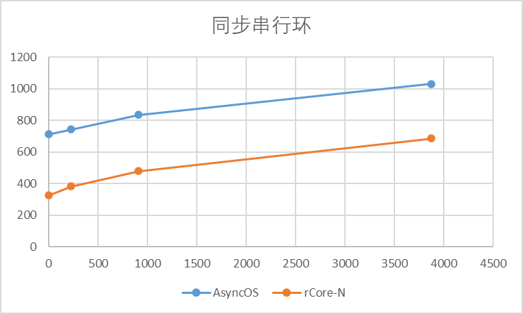
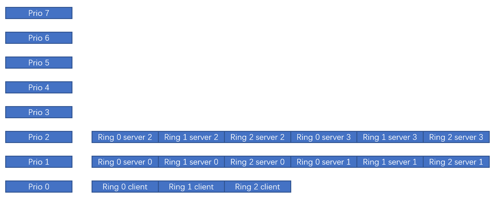
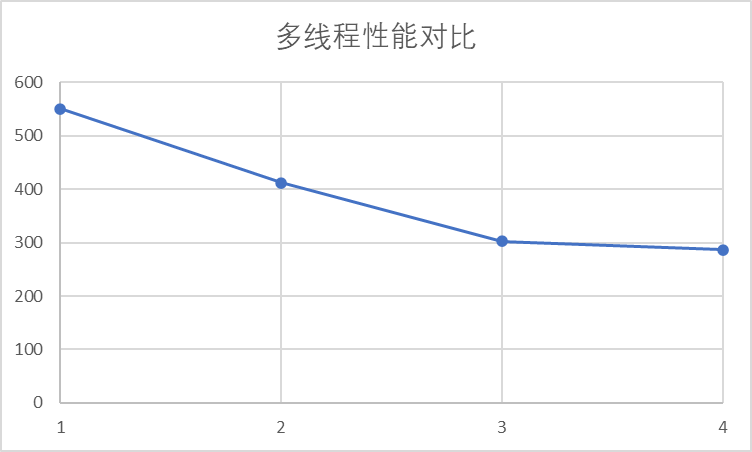

### 单线程下对比王文智学长的实验

#### 1. 串行管道环

Server 同步读（环长3000）
|字符串长度|1 | 228 | 912 | 3876 |
|---|---|---|---|---|
|AsyncOS| 713 ms | 743 ms | 836 ms| 1032 ms  | 
| rCore-N|326 ms | 383 ms | 479 ms| 687/924 ms |

Server 异步读（环长512）
|字符串长度| 1|228 | 912 | 3876 |
|---|---|---| --- | ---|
|AsyncOS| 5361 ms| 5352 ms | 5348 ms| 5337 ms  | 
| rCore-N | 92 ms | 94 ms | 112 ms| 157 ms |

# 多线程下管道环的性能提升

实验设置3个环，每个环长度1024，读写字符串长度为912，就绪队列布局如下：

性能对比如下：

|线程数| 1|2 | 3 | 4 |
|---|---|---| --- | ---|
| rCore-N | 551 ms | 412 ms | 303 ms| 287 ms |

