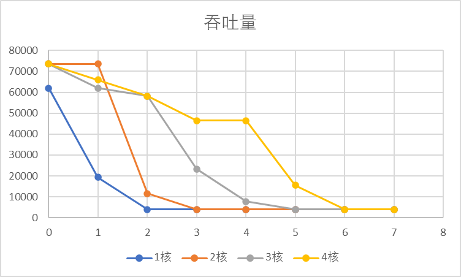
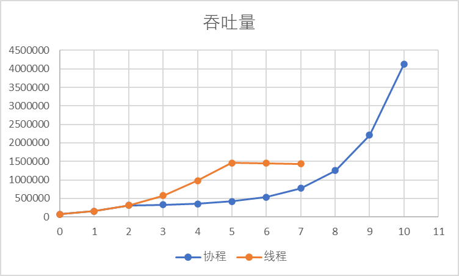

测试目标：
-  证明单线程下性能不弱于学长的模型。
- 多线程下性能有提升。
- 设置不同优先级的相同任务，完成有先后次序（或者相同时间内的吞吐量不同）。
- 动态优先级调整可以减小抖动（动态优先级未实现，暂不考虑 ）（x）。
- 实现相同效果，性能比线程模型要好。

1. 串行管道环实验。
2. 用管道模拟长连接，用异步读监听每个连接来模拟服务端，用其他协程定时写来模拟客户端。

## 不同优先级的吞吐量实验

建立了8个不同优先级的连接，每个客户端每10ms发送一个长 3876字节 的消息，服务端每收到一个消息，处理 50 ms（用忙等代替），统计 1 s 内每个连接的吞吐量。

|优先级|0 | 1 | 2 | 3 | 4 | 5 | 6 | 7 |
|---|---|---|---|---|---|---|---|---| 
|单线程| 62016 | 19380  | 3876 | 3876 |3876 | 3876| 3876| 3876| 
| 双线程 |73644 | 73644  | 11628 | 3876 |3876 | 3876| 3876| 3876| 
| 三线程 |73644 | 62016  | 58140 | 23256 |7752 | 3876| 3876| 3876| 
| 四线程 |73644 | 65892  | 58140 | 46512 |46512 | 15504| 3876| 3876| 

横轴是优先级，纵轴是吞吐量（单位 byte）。

## 进程实现与线程实现的比较

建立若干相同优先级的连接，每个客户端每10ms发送一个长 3876 的消息，服务端每收到一个消息，处理 50 ms，统计 1 s 内总共吞吐量。

|连接数| 1 |2 | 4 | 8 | 16 | 32 | 64 | 128 | 256 | 512 | 1024 |
|---|---|---|---|---|---|---|---|---| --- | --- | --- |
|协程| 77520 | 155040  | 310080 | 325584 |356592 | 418608| 538764| 775200|1251948 | 2205444 | 4120188 |
| 线程 |77520 | 155040  | 310080 | 577524 |984504 | 1457376| 1453500| 1437996| |

横轴是连接数（2的n次幂），纵轴是吞吐量（单位 byte）。