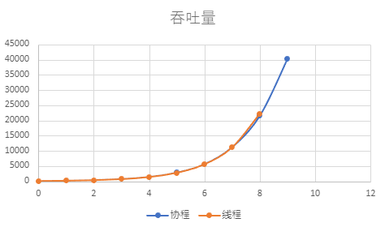
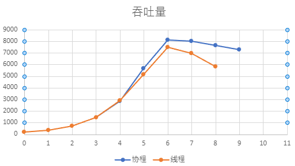
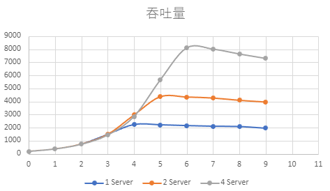
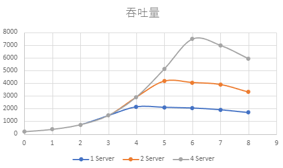

## 进程实现与线程实现的比较

1. 客户端保证一致。

## Lab1
50 * 50 矩阵运算。200 ms发送一次长 3876字节的消息，server线程数4，运行 5 s的吞吐量（单位KB）。
注：线程模型是指接收线程和服务线程分开（即接收后发送到另一个线程做耗时处理），线程2模型是指接收线程和服务线程是同一个线程（即接收后立即做耗时处理）

|连接数| 1 |2 | 4 | 8 | 16 | 32 | 64 | 128 | 256 | 512 |
|---|---|---|---|---|---|---|---|---| --- | --- |
|协程| 90 | 181  | 363 | 722 |1419 | 2827| 5602| 11192|21507 | 40258 | 
| 线程 |87 | 174  | 348 | 696 |1392 | 2785| 5571| 11143|22275 |
| 线程2 |90 | 181  | 363 | 726 |1392 | ... | ...| ...|... |

可以看出当单个消息的模拟处理耗时不长，且发送频率不高时，线程模型和进程模型的区别不大。进程2模型由于接收线程的阻塞，导致发送线程也不断阻塞，在连接数超过32后吞吐量骤降到100以下，且波动较大。

## Lab2
100 * 100 矩阵运算。100 ms发送一次长 3876字节的消息，server线程数4，运行 5 s的吞吐量（单位KB）。

|连接数| 1 |2 | 4 | 8 | 16 | 32 | 64 | 128 | 256 | 512 |
|---|---|---|---|---|---|---|---|---| --- | --- |
|协程| 181 | 367  | 726 | 1430 |2850 | 5658| 8104| 8009|7638 | 7297 | 
| 线程 |181 | 363  | 726 | 1453 |2907 | 5128/5753| 7483| 6983|5832 |
| 线程2 |185 | 370  | 741 | 1483 |... | ... | ...| ...|... |

1. 前期的重合部分是由于连接量不大，消息数不多，Server线程能够处理得过来。32个连接数之后开始出现差异，而协程模型能够腾出更多的CPU资源来进行Server服务，线程模型需要更多的CPU资源来处理发送和接收线程的切换。
2. 从128个连接后开始下降，是因为此时Server线程此时满载。线程模型下降是因为需要更多的CPU资源来处理接收和发送，协程模型下降是因为较多的用户态中断处理。

## Lab3
server线程数1，100 * 100 矩阵运算， 100 ms发送一次长 3876字节的消息。运行 5 s的吞吐量。
|server线程数| 1 |2 | 4 | 8 | 16 | 32 | 64 | 128 | 256 | 512 |
|---|---|---|---|---|---|---|---|---| --- | --- |
|协程| 185 | 370  | 741 | 1483 |2240 | 2218| 2157| 2108|2085 | 1953 | 
| 线程 | 181|  363 | 726 | 1453 |2146 |2104 |2051 | 1915|1688 |

server线程数2，100 * 100 矩阵运算， 100 ms发送一次长 3876字节的消息。运行 5 s的吞吐量。
|server线程数| 1 |2 | 4 | 8 | 16 | 32 | 64 | 128 | 256 | 512 |
|---|---|---|---|---|---|---|---|---| --- | --- |
|协程| 185 | 370  | 741 | 1483 |2967 | 4368| 4341| 4265|4091 | 3959 | 
| 线程 |181 |  363 | 726 | 1453 | 2907| 4175|4057 | 3902| 3300|

协程模型下，Server线程数对吞吐量的加速比。

线程模型下，Server线程数对吞吐量的加速比。

# 讨论日志

## 测试指标

测试两个模型的四个维度：线程模型、协程模型的创建、切换和销毁开销。

性能指标：吞吐量、处理时延、处理时延的抖动。

影响因素：优先级、CPU资源，模型类型。

## 测试场景

1. 服务端的三个基本任务：计算、收、发。
	1. 考虑计算量对性能的影响。
2. 连接：不同优先级的连接的性能指标、以及CPU资源对保证的优先级连接数目的变化影响
3. 优先级设置：三个基本任务设置优先级，不同连接设置优先级。
4. 线程与协程的组合方式：三个基本任务采用不同的模型组合。

## 实验设置

当前的实验框架下，只考虑衡量切换开销。

客户端要尽可能少地影响服务端，因此采用协程模型。

### Lab1

测量线程与协程的组合方式对性能的影响。

任务优先级设置的组合（三种）和模型设置的组合（三种），共九组实验。

- 通过相同优先级设置的不同模型组合的性能对比，分析模型切换的性能开销。
- 通过不同优先级设置的相同模型组合的性能对比，分析优先级设置的影响。

### Lab2
- 测量不同优先级连接的性能指标，目前只能设置协程模型下的优先级。
- 测量不同CPU数量下可保证的连接数（？比较模糊）

### Lab3

测试计算量对性能的影响。

不同计算量（3种）下的9个组合（任务优先级设置的组合（三种）和模型设置的组合（三种）），共27组实验。

