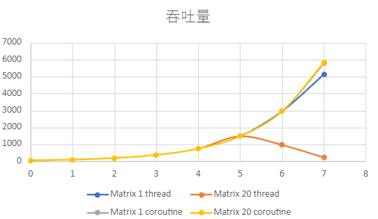
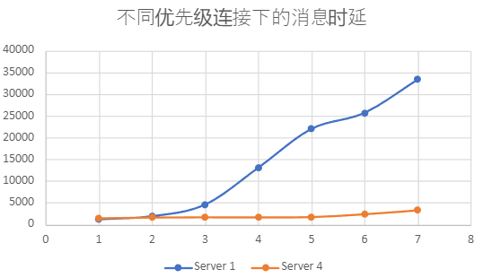
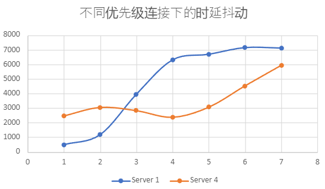

## 实验设置

当前的实验框架下，只考虑衡量切换开销。

客户端要尽可能少地影响服务端，因此采用协程模型。

### Lab1

测量线程与协程的组合方式对性能的影响。

任务优先级设置的组合（三种）和模型设置的组合（三种），共九组实验。

- 通过相同优先级设置的不同模型组合的性能对比，分析模型切换的性能开销。
- 通过不同优先级设置的相同模型组合的性能对比，分析优先级设置的影响。

### Lab2
- 测量不同优先级连接的性能指标，目前只能设置协程模型下的优先级。
- 测量不同CPU数量下可保证的连接数（？比较模糊）

### Lab3

测试计算量对性能的影响。

不同计算量（3种）下的9个组合（任务优先级设置的组合（三种）和模型设置的组合（三种）），共27组实验。

## 三个子任务都是线程模型。

matrix size: 1   ;   send timer interval: 100 ms  ； run time limit: 5000 ms

|连接数| 1 |2 | 4 | 8 | 16 | 32 | 64 | 128 | 256 |
|---|---|---|---|---|---|---|---|---| --- |
| 吞吐量(请求数) |46 | 92  | 184 |368  |736 | 1472 |2944 | 5140| |
| 平均时延(um) |320 | 461  |  866| 1960 |4890 |13539 |42316|117541 | |
| 时延标准差 |56 |123 | 316 |795  |1944 | 4792|14892 |169539 | |

matrix size: 20   ;   send timer interval: 100 ms  ； run time limit: 5000 ms

|连接数| 1 |2 | 4 | 8 | 16 | 32 | 64 | 128 | 256 |
|---|---|---|---|---|---|---|---|---| --- |
| 吞吐量(请求数) |46 | 92  | 184 |368  |736 | 1472 |957 |214 | |
| 平均时延(um) |485 | 621  |  997| 2159 |4929 |13531 |62071 |206137 | |
| 时延标准差 |99 |139   | 362 |800  |1918 | 5103|31423 |251482 | |

## 三个子任务都是协程模型。

matrix size: 1   ;   send timer interval: 100 ms  ； run time limit: 5000 ms  prio(receive, server, sender) = (2, 2, 2)

|连接数| 1 |2 | 4 | 8 | 16 | 32 | 64 | 128 | 256 |
|---|---|---|---|---|---|---|---|---| --- |
| 吞吐量(请求数) |46 | 92  | 184 |368  |736 | 1472 |2944 |5779 | |
| 平均时延(um) |462 | 469  |  640| 728 |779|1352 |1540 |2556 | |
| 时延标准差 |57 |  74 | 152 |278  |629 | 2132| 2421|3819 | |

matrix size: 1   ;   send timer interval: 100 ms  ； run time limit: 5000 ms  prio(receive, server, sender) = (4, 3, 2)

|连接数| 1 |2 | 4 | 8 | 16 | 32 | 64 | 128 | 256 |
|---|---|---|---|---|---|---|---|---| --- |
| 吞吐量(请求数) |46 | 92  | 184 |368  |736 | 1472 |2944 |5838 | |
| 平均时延(um) |463 | 496  |  617| 729 |883|1079 |1499 |2091 | |
| 时延标准差 |49 |  76 | 120 |221  |351 | 520| 3202|3023 | |

matrix size: 1   ;   send timer interval: 100 ms  ； run time limit: 5000 ms  prio(receive, server, sender) = (2, 3, 4)

|连接数| 1 |2 | 4 | 8 | 16 | 32 | 64 | 128 | 256 |
|---|---|---|---|---|---|---|---|---| --- |
| 吞吐量(请求数) |46 | 92  | 184 |368  |736 | 1472 |2944 |5867 | |
| 平均时延(um) |478 | 560  |  597| 751 |827|1024 |1497 |2614 | |
| 时延标准差 |68 |  66 | 142 |784  |328 | 881| 1736|4205 | |

matrix size: 20   ;   send timer interval: 100 ms  ； run time limit: 5000 ms  prio(receive, server, sender) = (2, 2, 2)

|连接数| 1 |2 | 4 | 8 | 16 | 32 | 64 | 128 | 256 |
|---|---|---|---|---|---|---|---|---| --- |
| 吞吐量(请求数) |46 | 92  | 184 |368  |736 | 1472 |2944 |5827 | |
| 平均时延(um) |575 | 624  |  728| 923 |1134|1265 |1749 |3179 | |
| 时延标准差 |65 |  105 | 158 |296  |412 | 1773| 1954|4734 | |

## 设置不同优先级组的连接，测量实验和吞吐量。

matrix size: 1   ;   send timer interval: 100 ms  ； run time limit: 5000 ms  prio(receive, server, sender) = (2, 2, 2)

Server虚拟CPU只有1个时

|优先级| 1 |2 | 3 | 4 | 5 | 6 | 7 |
|---|---|---|---|---|---|---|---|
| 吞吐量(请求数) |736 | 736  | 736 |736  |736 | 736 |736 |
| 平均时延(um) |1186 | 1900  |  4573| 13069 |22013|25711 |33385 |
| 时延标准差 |496 |  1178 | 3948 |6315  |6699 | 7157| 7124|

Server虚拟CPU有4个时

|优先级| 1 |2 | 3 | 4 | 5 | 6 | 7 |
|---|---|---|---|---|---|---|---|
| 吞吐量(请求数) |732 | 732  | 731 |731  |732 | 729 |731 |
| 平均时延(um) |1405 | 1595  |  1633| 1625 |1692|2343 |3243 |
| 时延标准差 |2466 |  3050 | 2827 |2372  |3064 | 4530| 5938|

# Lab

三个子任务全为进程和全为协程的对比：

横轴时连接数（2的幂次）。

Matrix 1 thread是指线程模型下，计算任务的计算量为 1 * 1 的矩阵运算，其他以此类推。

时延抖动和平均时延比较类似。

协程模型下不同优先级连接的时延和抖动如下：
横轴为连接优先级，Server 1 指的是服务端用1个虚拟CPU（线程）来执行，其他以此类推。

