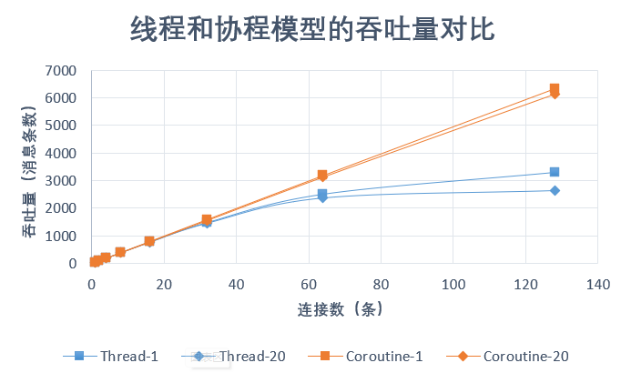
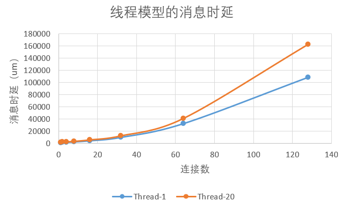
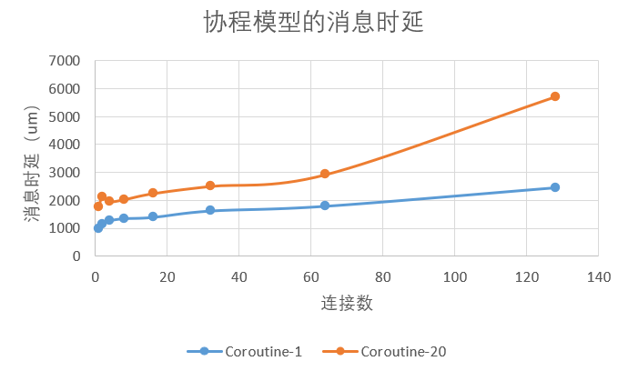
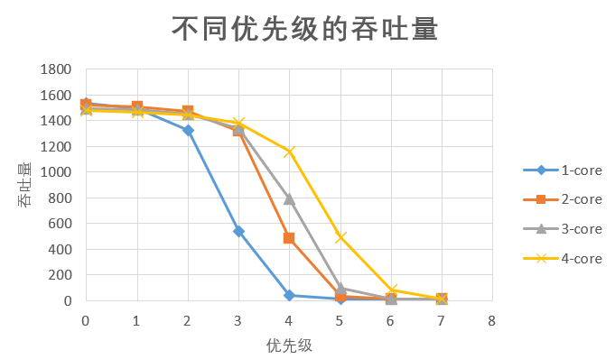
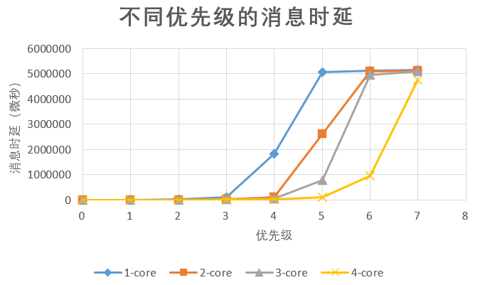
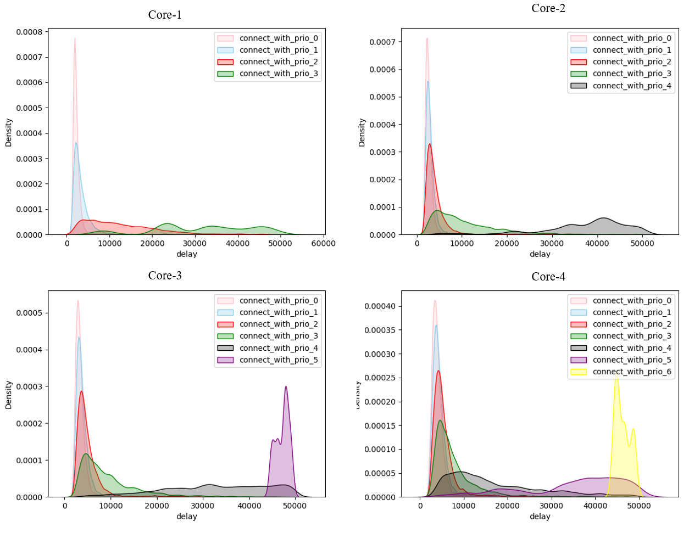

## 实验设置
使用网络驱动，客户端使用qemu外部的python脚本。用户态程序（包括堆分配器避免使用自旋锁）。

## 三个子任务都是线程模型。

matrix size: 1   ;   send timer interval: 100 ms  ； run time limit: 5000 ms

|连接数| 1 |2 | 4 | 8 | 16 | 32 | 64 | 128 | 256 |
|---|---|---|---|---|---|---|---|---| --- |
| 吞吐量(请求数) | 50 | 100   | 200 |392  | 781| 1490 |2513 |3301| |
| 平均时延(um) | 866 | 1180  | 1660 |2401  |4227 |9829 |32399|108451 | |
| 时延标准差 | 230|534 | 1948 | 2343 | 4969|13059 |32469 |92390 | |

matrix size: 20   ;   send timer interval: 100 ms  ； run time limit: 5000 ms

|连接数| 1 |2 | 4 | 8 | 16 | 32 | 64 | 128 | 256 |
|---|---|---|---|---|---|---|---|---| --- |
| 吞吐量(请求数) | 50 | 98   | 196 | 392 |768 |1461  |2367 |2632| |
| 平均时延(um) | 1548 | 2021  |2332  | 3150 |5531 | 12249|40959| 163202| |
| 时延标准差 |242 |407 |1828  | 2890 |7016 |15751 |39075 |127408 | |

## 三个子任务都是协程模型。

matrix size: 1   ;   send timer interval: 100 ms  ； run time limit: 5000 ms；prio(receive, server, sender) = (0, 0, 0) v-core: 4;

|连接数| 1 |2 | 4 | 8 | 16 | 32 | 64 | 128 | 256 |
|---|---|---|---|---|---|---|---|---| --- |
| 吞吐量(请求数) | 50  | 100   | 200 | 400 | 800| 1600 |3188 |6327| |
| 平均时延(um) | 994 | 1149  | 1274 |1352  |1397 | 1628|1799|2466 | |
| 时延标准差 |184 |247 | 396 | 514 | 823| 1568| 2701|5987 | |

matrix size: 20  ;   send timer interval: 100 ms  ； run time limit: 5000 ms；prio(receive, server, sender) = (0, 0, 0) v-core: 4;

|连接数| 1 |2 | 4 | 8 | 16 | 32 | 64 | 128 | 256 |
|---|---|---|---|---|---|---|---|---| --- |
| 吞吐量(请求数) | 50 |  98  | 196 | 392 |784 | 1568 | 3136|6138| |
| 平均时延(um) | 1782 | 2122  | 1962 |2034  |2250 |2511 |2928|5721 | |
| 时延标准差 |269 | 418| 571 | 741 |1172 |2075 |3897 |10155 | |

## 设置不同优先级组的连接，测量实验和吞吐量。

matrix size: 20   ;   send timer interval: 50 ms  ； run time limit: 5000 ms
8个优先级，每个优先级16个连接

Server虚拟CPU有1个时

|优先级| 0| 1 |2 | 3 | 4 | 5 | 6 | 7 |
|---|---|---|---|---|---|---|---| --- |
| 吞吐量(请求数) | 1532| 1496  |  1326| 536 | 43|  16|16 |16 |
| 平均时延(um) |2310 | 3593  | 10877 | 100481 |1822408| 5082712|5114446 | 5148450|
| 时延标准差 | 1960| 3383  | 9647 | 48608 |1648518 |10957 | 8646|9249 |

Server虚拟CPU有2个时

|连接数| 0 |1 | 2 | 3 | 4 | 5 | 6 | 7 | 
|---|---|---|---|---|---|---|---|---| --- |
| 吞吐量(请求数) | 1519 | 1506   | 1474 | 1315 |483 | 31 | 16|16 |
| 平均时延(um) | 2706 | 3163  |4445  | 11506 |118081 |2622222 |5093735| 5127053| 
| 时延标准差 |1815 |2209 | 4107 | 9646 | 50904| 2206196|12646 | 8907| 

Server虚拟CPU有3个时

|优先级| 0| 1 |2 | 3 | 4 | 5 | 6 | 7 |
|---|---|---|---|---|---|---|---| --- |
| 吞吐量(请求数) |1496 |1485   | 1453 | 1342 |792 |99  |16 | 16|
| 平均时延(um) |3433 | 3985  | 5190 | 10123 |52411|775682 |4952885 | 5111355|
| 时延标准差 | 1751| 2328  | 3673 | 8710 |23705 | 664375|729003 | 14827|

Server虚拟CPU有4个时

|优先级| 0| 1 |2 | 3 | 4 | 5 | 6 | 7 |
|---|---|---|---|---|---|---|---| --- |
| 吞吐量(请求数) |1478 | 1467  |1442  | 1382 | 1160|491  |81 | 17|
| 平均时延(um) | 4154| 4652  | 5689 | 8314 |19759|115298 |955704 |4768472 |
| 时延标准差 | 2884| 3330  |4601  |7272  | 16123|55180 | 922250| 1104334|

## 图表

### 吞吐量：

### 时延

线程模型和协程模型的时延相差较大，因此没有放在一张图上比较。

### 优先级

### 时延频率分布

我们将时延大于50ms的相应作为无效响应，在统计中去除后绘制各个优先级的时延频率分布图如下。

