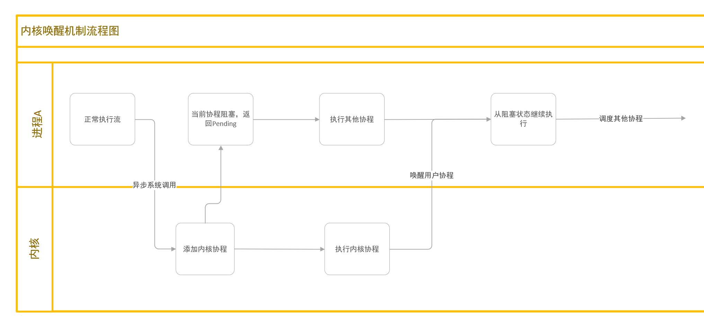

## 借助用户态中断实现异步协程的内核唤醒
共享调度器要逐步支持异步系统调用，在用户协程中执行系统调用后，进入内核态，内核将任务添加到内核协程的就绪队列中，然后立即从内核返回，返回到用户态后当前用户协程阻塞，转去执行其他协程。等待内核协程完成之后，由内核唤醒之前阻塞的用户协程继续执行。具体流程如下图所示：


这里我们考虑了两种思路：
- 内核态可以访问用户态进程下的就绪队列，因此可以直接将唤醒的协程id插入就绪队列中，但是由于内核与用户进程的**并发**性，需要考虑到读写安全的问题（这里只讨论有锁队列，不讨论无锁队列）：
	- 在单核环境下，用户态获取队列锁之后，有可能被时钟中断打断而被内核抢占，而内核在唤醒时需要获得锁来修改队列，此时的锁被用户程序获取，导致内核处于忙等的状态，rCore-N当前是不支持内核抢占的，因此内核将一直卡死在此。
	- 在多核环境下，上述问题可以得到解决。一个CPU核心在内核态等待该锁的时候，其他核可以重新调度该用户进程，用户进程用完之后就会释放锁，此时等锁的内核态的核心就能够获得锁，继续执行下去。
- 借助rCore-N的用户态软件中断，由内核向对应的进程的 `UserTrapQueue` 插入新的待处理中断，在处理用户中断的线程被内核调度，通过 `trap_return` 从内核返回时，检查 `UserTrapQueue`，并在用户态的中断处理函数将协程id插入就绪队列，该过程类似于信号的处理流程。具体流程参考[用户态中断中的软件中断](https://gallium70.github.io/rv-n-ext-impl/ch2_5_user_trap_management.html)。
	- 设想一下，如果处理用户态中断的线程也同时有执行用户协程的任务，那它就有可能在用户态正常执行流获得锁的时候被打断进入内核态，然后在内核态返回时检查到有待处理的中断，因此从 `trap_return` 之后会直接进入中断处理函数，在处理函数中需要获得就绪队列的锁，而此时的锁被正常执行流获得，因此会阻塞在此。直到时间片用完。可以想象，由于中断处理函数的优先级永远要高于正常处理流（必须先处理完中断，才能重新回到正常处理流），该线程将被永远阻塞。
	- 基于上述原因，处理用户态中断的线程不能同时执行用户协程的任务。

基于上述的讨论，我们采用第二种方案。

## 用户态中断处理线程
要获得内核唤醒协程的支持，需要执行库函数 `init_user_trap` ：
```rust
pub fn init_user_trap() -> isize {  
    let tid = thread_create(user_interrupt_handler as usize, 0);  
    let ans = sys_init_user_trap(tid as usize);  
    ans  
}
```

该库函数会创建一个线程用于专门处理用户态中断，并将该线程的tid传入内核存到 `PCB` 中用于内核指定特点的中断处理线程。

```rust
fn user_interrupt_handler() {  
    extern "C" {  
        fn __alltraps_u();  
    }    
    unsafe {  
        utvec::write(__alltraps_u as usize, TrapMode::Direct);  
        uie::set_usoft();  
        uie::set_utimer();  
    }  
    loop {  
        hang();  
    }
}
```
在该线程中，会将中断处理入口和处理模式写入 `utvec` 寄存器，然后使能用户态中断寄存器。

为了减小没有用户态中断时该线程的无用调度，在该线程中调用 `hang` 系统调用，将该线程阻塞，并移出内核的就绪线程队列中。
```rust
pub fn sys_hang() -> isize {  
    let task = current_task().unwrap();  
    current_process().unwrap().acquire_inner_lock().user_trap_handler_task = Some(task);  
    block_current_and_run_next();  
    0  
}
```

当内核捕获到（或产生)软件中断消息时再将其加入就绪队列中：
```rust
pub fn push_trap_record(pid: usize, trap_record: UserTrapRecord) -> Result<(), UserTrapError> {
	...
	if let Some(pcb) = pid2process(pid) {
		...
		if let Some(trap_info) = &mut pcb_inner.user_trap_info {  
		    let res = trap_info.push_trap_record(trap_record);  
		    let mut task = None;  
		    if pcb_inner.user_trap_handler_task.is_some() {  
		        task = pcb_inner.user_trap_handler_task.take();  
		    }    drop(pcb_inner);  
		    if task.is_some() {  
		        add_task(task.unwrap());  
		        debug!("wake handler task");  
		    }    
		    push_trace(PUSH_TRAP_RECORD_EXIT);  
		    res  
		}
		...
	}
}
```

## 用户接口
用户程序可以通过以下方式来选择相应的唤醒方式：
```rust
#[no_mangle]  
pub fn wake_handler(cid: usize) {  
    println!("wake tid: {}", cid);  
    re_back(cid);  
}
```
共享调度器提供了一个唤醒接口 `re_back` ，用户程序可以选择直接调用，或者进行一些用户级的间接处理。

## 其他用处

借助用户态中断的机制来实现异步协程的唤醒机制，不仅仅可以实现内核唤醒用户协程，同时也可以实现跨进程的协程唤醒，以便于跨进程的任务协同工作。