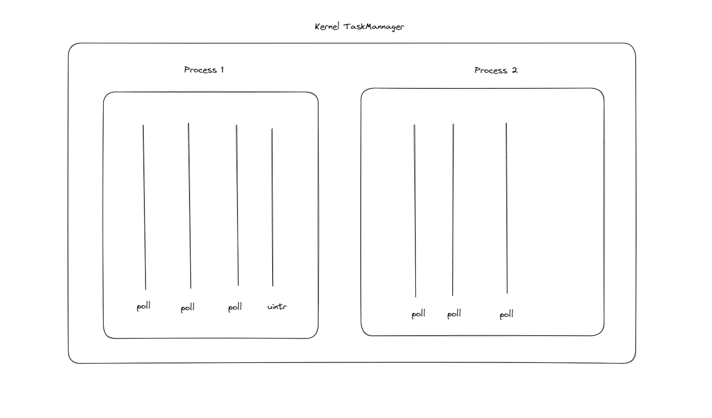

## 内核线程的模型下

当前内核中的线程调度模型是：先从中选出全局优先级最大的pid，然后遍历整个ready queue，找到第一个属于这个Pid的线程进行调度。

当前存在的问题：当进程内没有可以执行的协程时，整个进程的优先级处于最低，此时按照上面的线程调度模型，用户态中断线程无法被调度。两种解决方案：

- 第一种：当有用户态中断消息时，线程调度会优先调度uintr线程。这样会有一个问题：由于uintr线程中断处理例程需要获取调度器的锁，当锁被其他线程占用时，uintr只能等待，又由于uintr此时优先级最高，因此其他持有锁的线程无法被调度来释放锁，导致整个进程卡死。
- 第二种：当uintr被激活时，将整个进程的优先级都调整到较高的状态，此时，uintr就会被优先调度。副作用是由于同一进程内的uintr线程和普通的poll线程优先级相同，导致该进程内优先级并不算高的协程也会执行。

总结一下，如果使用内核线程来处理用户态中断例程，由于用户态中断例程和普通的poll执行流都要竞争获取调度器的锁，因此为了他们能够有序竞争和释放，要时刻保证两类线程的优先级处于平等的状态，才不会导致死锁。