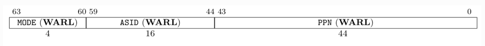
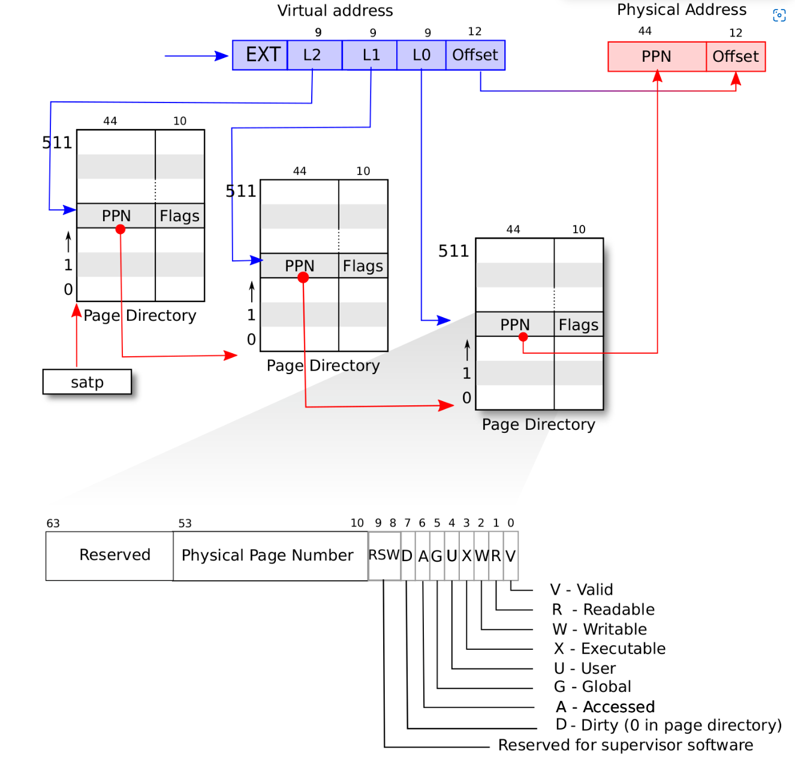
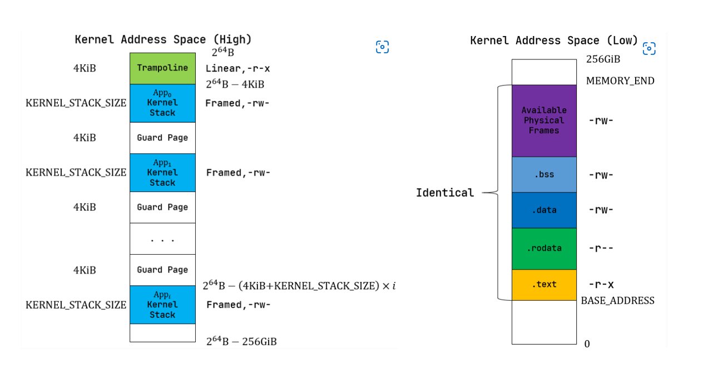
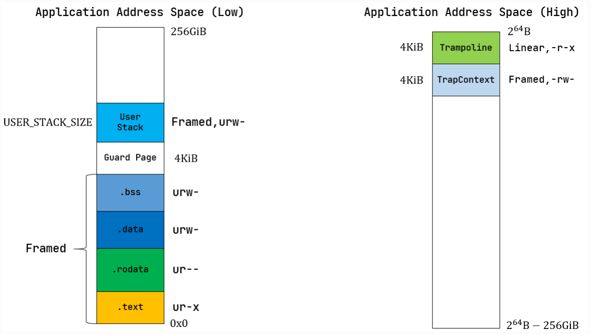

# rCore代码笔记-ch4
[[2022-05-29]]


这章代码量有点大，类与类之间的关系太乱了。

本章主要介绍操作系统的物理内存的管理，到目前为止，我们的实验性操作系统无论是内核还是用户程序，都是直接使用的物理地址，且在他们的视野内是可以看到整个物理地址空间的，这就带来了两个很大的问题：
- 用户程序可以通过物理内存修改其他用户程序的代码数据甚至内核的代码数据，这是非常不安全的。
- 此外，由于用户程序的加载强依赖于物理地址，因此我们在编写用户程序的时候就需要考虑程序在物理内存中的布局以防止和其他用户程序和内核程序之前的重叠，这给用户程序编写者带来了极大的不便。

本章就主要介绍了虚拟地址和地址空间的实现，来解决以上两个问题。

参考资料：[第四章：地址空间 — rCore-Tutorial-Book-v3 3.6.0-alpha.1 文档 (rcore-os.github.io)](https://rcore-os.github.io/rCore-Tutorial-Book-v3/chapter4/)

## 物理地址和虚拟地址

CPU访问内存使用的都是物理地址，它是由与CPU连接和内存连接的若干地址线的高低电平确定的，而虚拟地址则是用户程序抽象后使用、不能直接被CPU访问的地址，CPU要访问内存，需要先把虚拟地址转化为物理地址后才能访问。而如何确定虚拟地址和物理地址的转化关系，是我们这章的重点。

> 操作系统和计算机硬件是相互促进发展的，CPU的发展促使操作系统的革新，而操作系统的需求也促进这CPU的变革。虚拟地址和地址空间的概念是操作系统所提出，但处于性能的考虑和操作系统实现的角度，CPU也适配了硬件部分——地址转换单元（MMU），它可以将虚拟地址自动地转换为物理地址，只需要我们在开启MMU之前设置好两者之间的映射关系并注册给MMU即可。

对于RISC-V64而言，默认情况下，无论CPU处于那个特权级，都是直接将地址当作物理地址进行访问（MMU未被使能）。我们可以修改 satp 寄存器来启动分页模式，之后所有到达CPU的地址都将被视作虚拟地址，需要经过MMU翻译后才能作为物理地址进行访问，下面是 satp 寄存器的相关字段简介：



- MODE 控制CPU采用哪种MMU方案，当设置为0时，表示所有访存都被视为物理地址，当设置为8时，采用本文介绍的SV39的映射方案，后面会详细介绍。
- ASID 用于表示进程空间，将会在第五章涉及。
- PPN 存放第一级页表所在的物理页号，用于表示整个页表系统所在的物理地址。


#### 基本概念
在 SV39 的映射方案中，每个物理页和虚拟页的大小被设置为4KB（需要12位来标识页内偏移），所有的地址都被视为一个39位的虚拟地址，包含了27位的页号标识和12位的页内偏移：


> 在64位的架构中，地址总线应该时64根，对应的虚拟地址也应该时64位，但是 SV39 仅仅使用低39位，高25位必须与第38位保持一致，才能通过MMU的检查（硬件实现），换句话说，只有 0 —— 0000003FFFFFFFFF（低256GB）和 FFFFFC000000000 —— FFFFFFFFFFFFFFFF（高256G）才能通过MMU检查。

而39位的虚拟地址将被翻译位56位的物理地址，包含了44位的物理页号和12位的页内偏移。


#### 地址相关的数据结构抽象和定义
先给出物理地址、虚拟地址、物理页号、虚拟页号的声明，他们在底层都是usize类型：

```rust
/// Definitions
#[derive(Copy, Clone, Ord, PartialOrd, Eq, PartialEq)]
pub struct PhysAddr(pub usize);

/// virtual address
#[derive(Copy, Clone, Ord, PartialOrd, Eq, PartialEq)]
pub struct VirtAddr(pub usize);

/// physical page number
#[derive(Copy, Clone, Ord, PartialOrd, Eq, PartialEq)]
pub struct PhysPageNum(pub usize);

/// virtual page number
#[derive(Copy, Clone, Ord, PartialOrd, Eq, PartialEq)]
pub struct VirtPageNum(pub usize);
```

然后我们需要增加他们通过usize转化的方法、他们转化为usize的方法、他们之间相互转换的方法，这部分比较简单，就不展开叙述。

## SV39 内存映射方案
SV39内存映射方案根据三级页表来查询得到物理页号，然后根据物理页号和页内偏移拼接得到最终的物理地址，上述的转换是MMU自动进行的，只需要我们操作系统在使能 sapt 之前设置好对应的三级页表即可。

页表中存放了若干的页表项（PTE），每个页表项标识了一个物理页和该页的权限。页表项的相关字段如下：


高10位保留，而中间的三个PPN作为MMU地址转换时的页表索引，而RSW两位留给S Mode的应用程序用于扩展。低8位则是标准位，用于描述页表项所描述的页表的状态：
-   V(Valid)：仅当位 V 为 1 时，页表项才是合法的；
-   R(Read)/W(Write)/X(eXecute)：分别控制索引到这个页表项的对应虚拟页面是否允许读/写/执行；
-   U(User)：控制索引到这个页表项的对应虚拟页面是否在 CPU 处于 U 特权级的情况下是否被允许访问；
-   G：暂且不理会；
-   A(Accessed)：处理器记录自从页表项上的这一位被清零之后，页表项的对应虚拟页面是否被访问过，会被处理器动态设置；
-   D(Dirty)：处理器记录自从页表项上的这一位被清零之后，页表项的对应虚拟页面是否被修改过；会被处理器动态设置。

而整个查询页表的流程，仅仅只需要一幅图就可以描绘清楚：



我们将虚拟地址的中间27位虚拟页号分为三个部分$index_i（i = 0, 1, 2)$，每个部分对应一个查表流程：
1. satp存放一级页表的物理页号。
2. $satp[43:0] << 12 + index_0 \times 8$得到$pte_0$的物理地址。
3. $pte_0[53:10] << 12 + index_1 \times 8$得到$pte_1$的物理地址。
4. $pte_1[53:10] << 12 + index_2 \times 8$得到$pte_2$的物理地址。
5. $pte_2[53:10] << 12 + offset$最终得到虚拟地址对应的物理地址。

当操作系统在初始化页表时，是一个从无到有、按需加载的过程，他会判断拿到的$pte_i (i = 0, 1)$是否合法，如果不合法，代表下一级页表不存在，因此需要申请一个物理页框来存放下一级页表.

而当操作系统进行访存操作时，则只会判断pte_i (i = 0, 1)$是否合法，如果不合法，代表当前访问的虚拟地址对应的物理地址不在内存中，会触发缺页异常，通过异常来进行下一步操作。

## 内存布局

#### 物理内存
我们硬编码整块物理内存的终止物理地址为 `0x80800000`，而之前提到的物理内存的起始物理地址为 `0x80000000`，总共的内存为 8 MB。系统内核的镜像需要有一个固定的物理内存存放，而其他剩余的为止都可以由内核进行统一分配。因此，物理内存的布局就如下：
- $[0x80000000, ekernel]$为内核镜像的内存。
- $[ekernel, 0x80800000]$为内核管理的内存。

既然由内核统一管理，那我们应当有一个物理内存分配器，它全局唯一，且提供分配和回收内存的方法：
```rust
pub struct StackFrameAllocator {
    current: usize,
    end: usize,
    recycled: Vec<usize>,
}

trait FrameAllocator {
    fn new() -> Self;
    fn alloc(&mut self) -> Option<PhysPageNum>;
    fn dealloc(&mut self, ppn: PhysPageNum);
}
```

这里不贴出实现，简单阐述一下：物理页帧分配器会用$[current, end]$维护从未分配过的内存范围，用一个向量$recycled$维护已经分配过（即使已经释放了）的内存范围。当然我们最开始对他进行初始化时的范围为$[ekernel, 0x80800000]$。


#### 虚拟内存

物理内存是实实在在的资源，因此它的布局是唯一的。而虚拟内存则不同，这里的虚拟内存我们需要认识到：内核的虚拟内存（或者叫做地址空间）和应用程序的地址空间是相互独立的，应用程序之间的地址空间也是相互独立的。区分他们的就是：页表，内核的地址空间对应了一个单独的页表，每个应用程序也有着自己的页表。当CPU执行内核代码或者某个应用程序时，需要同步地使用对应的页表。

对于内核的地址空间而言，为了在内核开启MMU之后能够正常访问内核的数据和代码段，我们把内核镜像的虚拟地址和物理地址做一个恒等映射，也就是说，内核镜像中的各个段以及可用的物理页帧的虚拟地址就等于物理地址。而对于应用程序的各个内核栈，我们则把他们的虚拟地址存放到高端地址上。具体图示如下：



>就个人的理解而言，这种内存分布方式只是一种设计，并不是硬性规定，内核的实现者完全可以根据自己的需要调整虚拟内存的布局。

而对于应用程序而言，我们之前提到过，虚拟内存的目的之一就是让各个应用程序的编址相互独立，不用再顾及是否会与其他程序的编址冲突，因此我们选择的应用程序的编址如下图所示：



低端地址存放的是程序镜像中的各个段和用户栈，高端地址则存放了内核需要用到的Trap上下文。

>无论是内核空间还是应用程序空间，栈与其他段之间都有一个Gap，大小为一个Page。这是由于编译器会对访存顺序和局部变量在栈帧中的位置进行优化，我们难以确定一个已经溢出的栈帧中的哪些位置会先被访问，但总的来说，空洞区域被设置的越大，我们就能越早捕获到这一可能覆盖其他重要数据的错误异常。总之都是编译器优化的锅。

>值得注意的是无论是内核空间还是应用程序空间，再最高的虚拟页上，我们设置了一个trampoline跳板，就个人理解而言，这个设计是一个桥梁，我们回顾一下目前涉及到的地址空间切换，根本而言只是用户空间和内核空间的切换（用户空间与用户空间的切换被转化为用户 --> 内核 --> 新的用户），而在地址空间进行切换的时候，会有一段代码，既需要在用户空间访问，也需要在内核空间访问，是的，就是我们前面章节实现的内核陷入和恢复的代码。

## 代码走读
好了，上面罗里吧嗦了一大堆，真正理解还得看代码， rCore-Tutorial-Book-v3上面是自底向上来进行代码讲解，笔者不才，尝试自顶向下来分析一下这一章的代码实现，由于这章的代码量有点大，很多地方可能分析得不够详细，还请见谅。

先看一下main函数
```rust
// os/src/main.rs

#[no_mangle]
/// the rust entry-point of os
pub fn rust_main() -> ! {
    clear_bss();
    println!("[kernel] Hello, world!");
    mm::init();
    println!("[kernel] back to world!");
    mm::remap_test();
    trap::init();
    //trap::enable_interrupt();
    trap::enable_timer_interrupt();
    timer::set_next_trigger();
    task::run_first_task();
    panic!("Unreachable in rust_main!");
}

```

这里最重要的当然就是mm模块中的init了。

```rust
// os/src/mm/mod.rs

/// initiate heap allocator, frame allocator and kernel space
pub fn init() {
    heap_allocator::init_heap();
    frame_allocator::init_frame_allocator();
    KERNEL_SPACE.exclusive_access().activate();
}
```

在这个函数里，我们需要能让内核代码提前使用上“动态分配”的内存，以便我们使用Rust支持的各种高级数据结构。

> 注意这里的动态分配并不是真正意义上的动态分配的物理内存，而是在内核最开始的镜像中定义了一个较大的静态内存区域，我们对这片区域进行一个动态管理。

然后我们需要把我们的物理内存真正管理起来，之前提到过StackFrameAllocator就是为此而生的，它管理的内存的范围上面也提到过：$[ekernel, 0x80800000]$，注意与上一步的内核堆相区分，内核堆的内存本质上是在内核镜像链接时就确定了，是在$ekernel$之前的。而我们平时编写应用程序向操作系统申请的动态内存（如C的malloc）则是在这里分配的。

最后我们使用一个单例的KERNEL_SPACE来初始化内核空间，KERNEL_SPACE是一个被智能指针包裹的 MemorySet 结构体， 在第一次实例化时调用它的 new_kernel 方法：
```rust
// os/src/mm/memory_set.rs

pub struct MemorySet {
    page_table: PageTable,
    areas: Vec<MapArea>,
}

impl MemorySet {
	pub fn new_kernel() -> Self {
        let mut memory_set = Self::new_bare();
        // map trampoline
        memory_set.map_trampoline();
        // map kernel sections
        println!(".text [{:#x}, {:#x})", stext as usize, etext as usize);
        println!(".rodata [{:#x}, {:#x})", srodata as usize, erodata as usize);
        println!(".data [{:#x}, {:#x})", sdata as usize, edata as usize);
        println!(
            ".bss [{:#x}, {:#x})",
            sbss_with_stack as usize, ebss as usize
        );
        println!("mapping .text section");
        memory_set.push(
            MapArea::new(
                (stext as usize).into(),
                (etext as usize).into(),
                MapType::Identical,
                MapPermission::R | MapPermission::X,
            ),
            None,
        );
        println!("mapping .rodata section");
        memory_set.push(
            MapArea::new(
                (srodata as usize).into(),
                (erodata as usize).into(),
                MapType::Identical,
                MapPermission::R,
            ),
            None,
        );
        println!("mapping .data section");
        memory_set.push(
            MapArea::new(
                (sdata as usize).into(),
                (edata as usize).into(),
                MapType::Identical,
                MapPermission::R | MapPermission::W,
            ),
            None,
        );
        println!("mapping .bss section");
        memory_set.push(
            MapArea::new(
                (sbss_with_stack as usize).into(),
                (ebss as usize).into(),
                MapType::Identical,
                MapPermission::R | MapPermission::W,
            ),
            None,
        );
        println!("mapping physical memory");
        memory_set.push(
            MapArea::new(
                (ekernel as usize).into(),
                MEMORY_END.into(),
                MapType::Identical,
                MapPermission::R | MapPermission::W,
            ),
            None,
        );
        memory_set
    }
}
```

一个MemorySet包含了一个page_table和一系列的MapArea，page_table需要维护内核地址空间的映射关系，而一个MapArea包含了一个程序段中的虚拟地址范围、虚拟页和物理页帧的映射关系、映射类型、访问权限等。
```rust
// os/src/mm/page_table.rs

pub struct PageTable {
    root_ppn: PhysPageNum,
    frames: Vec<FrameTracker>,
}

// os/src/mm/memory_set.rs
pub struct MapArea {
    vpn_range: VPNRange,
    data_frames: BTreeMap<VirtPageNum, FrameTracker>,
    map_type: MapType,
    map_perm: MapPermission,
}
```

从new_kernel看来我们先通过new_bare生成了一个新的PageTable，然后调用map_trampoline方法在页表中建立最高一个页的虚拟地址到trampoline的物理地址的映射关系：
```rust
// os/src/mm/memory_set.rs

fn map_trampoline(&mut self) {
	self.page_table.map(
		VirtAddr::from(TRAMPOLINE).into(),
		PhysAddr::from(strampoline as usize).into(),
		PTEFlags::R | PTEFlags::X,
	);
}

// os/src/linker-qemu.ld
BASE_ADDRESS = 0x80200000;
......
stext = .;
.text : {
	*(.text.entry)
	. = ALIGN(4K);
	strampoline = .;
	*(.text.trampoline);
	. = ALIGN(4K);
	*(.text .text.*)
}

// os/src/trap/trap.S
    .section .text.trampoline
    .globl __alltraps
    .globl __restore
    .align 2
__alltraps:
...

__restore:
...

```
从linker-qemu.ld和trap.S中可以看出，物理地址在strampoline的代码段是中断和异常处理入口和恢复的出口。我们通过map_trampoline方法把这部分映射到了内核地址空间的最高处。

然后我们依次将代码段、只读数据段、数据段、静态内存段和可用的剩余物理内存按照恒等映射的类型将映射关系写入page_table。这样按照恒等映射初始化的内核空间，当在内核态开启MMU之后，之前访问的物理地址变成了虚拟地址，经过MMU查询页表后得到的物理地址还是之前的物理地址，这样就保证了指令流水的一致性。

在KERNEL_SPACE初始化完成后我们调用active方法使能MMU：
```rust
pub fn activate(&self) {
	let satp = self.page_table.token();
	unsafe {
		satp::write(satp);
		asm!("sfence.vma");
	}
}

```
这里使能MMU时需要指定内核空间对应的页表的物理页号并写入satp中，并清空缓存（开启虚拟地址后，之前快表（TLB）中缓存的映射关系都将失效，因此需要清洗TLB）。

到此为止mm::init就做了这些事情，算是把内核空间给搞定了，仔细想想，虽然用起来没啥差别，因为做了一个恒等映射，之间访问到哪儿，现在还是访问到哪儿，但其中的过程却是大不相同，在访存的时候不是一开始拿着地址就当作物理地址访问，而是通过MMU翻译之后得到物理地址，只是说翻译了一通最后发现等于一开始拿到的虚拟地址，虽说过程曲折，但结果倒是一样。

然后我们需要看一下trap::init，在开启虚拟地址空间之后，trap的处理也有了一些变化。

我们需要考虑当内核发生异常时，我们用户态的异常分开处理（至于为什么，不太清楚....）
```rust
// os/src/trap/mod.rs

pub fn init() {
    set_kernel_trap_entry();
}

fn set_kernel_trap_entry() {
    unsafe {
        stvec::write(trap_from_kernel as usize, TrapMode::Direct);
    }
}

fn set_user_trap_entry() {
    unsafe {
        stvec::write(TRAMPOLINE as usize, TrapMode::Direct);
    }
}
```

我们提供了两个trap的入口，trap_from_kernel供内核使用，而TRAMPOLINE供用户程序使用，请注意，这里的MMU已经被使能了，我们拿到的是虚拟地址，trap_from_kernel的虚拟地址在内核态被使用，因此是恒等映射为物理地址进行访存的，而set_user_trap_entry中的TRAMPOLINE的虚拟地址被用户程序使用，所以在所有的用户程序中，我们需要把TRAMPOLINE的虚拟地址映射到之前所说的__alltraps代码对应的物理地址处，虽说我们现在还没有设置用户程序的地址空间，但是我们完全可以猜想，在设置用户地址空间时一定会调用map_trampoline方法。

然后我们看一下trap_handler函数，该函数在用户态陷入内核态时调用：
```rust
// os/src/trap/mod.rs

pub fn trap_handler() -> ! {
    set_kernel_trap_entry();
	...
	trap_return();
}

pub fn trap_return() -> ! {
    set_user_trap_entry();
    let trap_cx_ptr = TRAP_CONTEXT;
    let user_satp = current_user_token();
    extern "C" {
        fn __alltraps();
        fn __restore();
    }
    let restore_va = __restore as usize - __alltraps as usize + TRAMPOLINE;
    unsafe {
        asm!(
            "fence.i",
            "jr {restore_va}",             // jump to new addr of __restore asm function
            restore_va = in(reg) restore_va,
            in("a0") trap_cx_ptr,      // a0 = virt addr of Trap Context
            in("a1") user_satp,        // a1 = phy addr of usr page table
            options(noreturn)
        );
    }
}
```

可以看出当内核态接管程序时，中断或异常的入口会被重新设置为trap_from_kernel，而让trap执行完毕，从内核态返回用户态时，会把中断或异常的入口重新设置为TRAMPOLINE，以保证用户态和内核态都能找到对应的异常处理入口。

时钟中断的设置与之前无异，这里不再赘述。

终于迎来了我们的最后一个环节，加载用户程序并设置用户空间：
```rust
// os/src/loader.rs
pub static ref TASK_MANAGER: TaskManager = {
	println!("init TASK_MANAGER");
	let num_app = get_num_app();
	println!("num_app = {}", num_app);
	let mut tasks: Vec<TaskControlBlock> = Vec::new();
	for i in 0..num_app {
		tasks.push(TaskControlBlock::new(get_app_data(i), i));
	}
	TaskManager {
		num_app,
		inner: unsafe {
			UPSafeCell::new(TaskManagerInner {
				tasks,
				current_task: 0,
			})
		},
	}
};
```

TASK_MANAGER作为一个单例，在第一次实例化时候读取link_app.S中的用户程序数据，并初始化一系列的TaskControlBlock。
```rust
// os/src/task/task.rs

pub struct TaskControlBlock {
    pub task_status: TaskStatus,
    pub task_cx: TaskContext,
    pub memory_set: MemorySet,
    pub trap_cx_ppn: PhysPageNum,
    pub base_size: usize,
}

impl TaskControlBlock {
	pub fn new(elf_data: &[u8], app_id: usize) -> Self {
        // memory_set with elf program headers/trampoline/trap context/user stack
        let (memory_set, user_sp, entry_point) = MemorySet::from_elf(elf_data);
        let trap_cx_ppn = memory_set
            .translate(VirtAddr::from(TRAP_CONTEXT).into())
            .unwrap()
            .ppn();
        let task_status = TaskStatus::Ready;
        // map a kernel-stack in kernel space
        let (kernel_stack_bottom, kernel_stack_top) = kernel_stack_position(app_id);
        KERNEL_SPACE.exclusive_access().insert_framed_area(
            kernel_stack_bottom.into(),
            kernel_stack_top.into(),
            MapPermission::R | MapPermission::W,
        );
        let task_control_block = Self {
            task_status,
            task_cx: TaskContext::goto_trap_return(kernel_stack_top),
            memory_set,
            trap_cx_ppn,
            base_size: user_sp,
        };
        // prepare TrapContext in user space
        let trap_cx = task_control_block.get_trap_cx();
        *trap_cx = TrapContext::app_init_context(
            entry_point,
            user_sp,
            KERNEL_SPACE.exclusive_access().token(),
            kernel_stack_top,
            trap_handler as usize,
        );
        task_control_block
    }
}
```

在初始化TaskControlBlock时，携带了用户程序的id和elf数据，因此会先根据elf数据通过MemorySet::from_elf方法初始化用户的地址空间，然后通过TRAP_CONTEXT的虚拟地址得到trap_context的物理地址，再在内核空间中设置当前应用程序对应的内核栈的映射关系。最后初始化trap_context中用户程序的执行入口，用户栈、内核空间的页表物理地址、内核栈和trap的入口地址。

```rust
// os/src/mm/memory.rs

impl MemorySet {
	pub fn from_elf(elf_data: &[u8]) -> (Self, usize, usize) {
        let mut memory_set = Self::new_bare();
        // map trampoline
        memory_set.map_trampoline();
        // map program headers of elf, with U flag
        let elf = xmas_elf::ElfFile::new(elf_data).unwrap();
        let elf_header = elf.header;
        let magic = elf_header.pt1.magic;
        assert_eq!(magic, [0x7f, 0x45, 0x4c, 0x46], "invalid elf!");
        let ph_count = elf_header.pt2.ph_count();
        let mut max_end_vpn = VirtPageNum(0);
        for i in 0..ph_count {
            let ph = elf.program_header(i).unwrap();
            if ph.get_type().unwrap() == xmas_elf::program::Type::Load {
                let start_va: VirtAddr = (ph.virtual_addr() as usize).into();
                let end_va: VirtAddr = ((ph.virtual_addr() + ph.mem_size()) as usize).into();
                let mut map_perm = MapPermission::U;
                let ph_flags = ph.flags();
                if ph_flags.is_read() {
                    map_perm |= MapPermission::R;
                }
                if ph_flags.is_write() {
                    map_perm |= MapPermission::W;
                }
                if ph_flags.is_execute() {
                    map_perm |= MapPermission::X;
                }
                let map_area = MapArea::new(start_va, end_va, MapType::Framed, map_perm);
                max_end_vpn = map_area.vpn_range.get_end();
                memory_set.push(
                    map_area,
                    Some(&elf.input[ph.offset() as usize..(ph.offset() + ph.file_size()) as usize]),
                );
            }
        }
        // map user stack with U flags
        let max_end_va: VirtAddr = max_end_vpn.into();
        let mut user_stack_bottom: usize = max_end_va.into();
        // guard page
        user_stack_bottom += PAGE_SIZE;
        let user_stack_top = user_stack_bottom + USER_STACK_SIZE;
        memory_set.push(
            MapArea::new(
                user_stack_bottom.into(),
                user_stack_top.into(),
                MapType::Framed,
                MapPermission::R | MapPermission::W | MapPermission::U,
            ),
            None,
        );
        // map TrapContext
        memory_set.push(
            MapArea::new(
                TRAP_CONTEXT.into(),
                TRAMPOLINE.into(),
                MapType::Framed,
                MapPermission::R | MapPermission::W,
            ),
            None,
        );
        (
            memory_set,
            user_stack_top,
            elf.header.pt2.entry_point() as usize,
        )
    }
}
```

上面时根据elf数据初始化应用地址空间的代码，首先调用new_bare生成一个页表，然后调用map_trampoline把TRAMPOLINE对应的虚拟地址映射到__alltraps代码的物理地址上，闭环了家人们。后面的循环处理无非是根据elf数据中的信息初始化用户代码的各个段罢了。在最后，我们分配物理页映射给用户栈和用户的TRAP_CONTEXT。

到此为止，用户的地址空间和任务状态都设置完成了。然后执行run_first_task。
```rust
// os/src/task/mod.rs

impl TaskManager {
	fn run_first_task(&self) -> ! {
		let mut inner = self.inner.exclusive_access();
		let next_task = &mut inner.tasks[0];
		next_task.task_status = TaskStatus::Running;
		let next_task_cx_ptr = &next_task.task_cx as *const TaskContext;
		drop(inner);
		let mut _unused = TaskContext::zero_init();
		// before this, we should drop local variables that must be dropped manually
		unsafe {
			__switch(&mut _unused as *mut _, next_task_cx_ptr);
		}
		panic!("unreachable in run_first_task!");
	}
}
```

它先从tasks中取出了一个任务，并把它的状态置位Running，然后取出TaskContext，并调用__switch函数将TaskContext的寄存器状态恢复。这里我们回顾一下任务的TaskContext是被初始化成什么样的：
```rust
// os/src/task/task.rs

impl TaskControlBlock {
	pub fn new(elf_data: &[u8], app_id: usize) -> Self {
		...
		let task_control_block = Self {
            task_status,
            task_cx: TaskContext::goto_trap_return(kernel_stack_top),
            memory_set,
            trap_cx_ppn,
            base_size: user_sp,
        };
		...
	}	
}

// os/src/task/context.rs
impl TaskContext {
	pub fn goto_trap_return(kstack_ptr: usize) -> Self {
		Self {
			ra: trap_return as usize,
			sp: kstack_ptr,
			s: [0: 12],
		}
	}
}
```

注意哈，还记得__switch函数是怎么做的吗，把TaskContext中的所有存起来的寄存器都进行恢复，其中最重要的ra寄存器，代表__switch函数返回后执行的地址，这里我们把它统一设置为了trap_return。
```rust
// os/src/trap/mod.rs

pub fn trap_return() -> ! {
    set_user_trap_entry();
    let trap_cx_ptr = TRAP_CONTEXT;
    let user_satp = current_user_token();
    extern "C" {
        fn __alltraps();
        fn __restore();
    }
    let restore_va = __restore as usize - __alltraps as usize + TRAMPOLINE;
    unsafe {
        asm!(
            "fence.i",
            "jr {restore_va}",             // jump to new addr of __restore asm function
            restore_va = in(reg) restore_va,
            in("a0") trap_cx_ptr,      // a0 = virt addr of Trap Context
            in("a1") user_satp,        // a1 = phy addr of usr page table
            options(noreturn)
        );
    }
}
```

在trap_return中，我们为用户态设置了中断处理入口，然后后面计算了当前内核地址空间下__restore函数的虚拟地址，我们之前讲过我们把__alltraps所在的物理页映射到最高的虚拟页中，而在同一个页中的__restore函数相对于__alltraps的偏移，无论是在物理内存空间还是虚拟地址空间都是一样的，因此我们可以通过偏移 + TRAMPOLINE直接计算出__restore的虚拟地址。然后我们通过jr指令调用该函数，并把当前任务的TrapContext的虚拟地址和页表的物理地址传入函数。

>在执行__restore函数之前，我们使用了fence.i指令清空指令缓存 i-cache。这是因为，在内核中进行的一些操作可能导致一些原先存放某个应用代码的物理页帧如今用来存放数据或者是其他应用的代码，i-cache 中可能还保存着该物理页帧的错误快照。因此我们直接将整个 i-cache 清空避免错误。

然后我们来重新看一下__restore函数的实现，它有了一些变化：
```rust
// os/src/trap/trap.S

__restore:
    # a0: *TrapContext in user space(Constant); a1: user space token
    # switch to user space
    csrw satp, a1
    sfence.vma
    csrw sscratch, a0
    mv sp, a0
    # now sp points to TrapContext in user space, start restoring based on it
    # restore sstatus/sepc
    ld t0, 32*8(sp)
    ld t1, 33*8(sp)
    csrw sstatus, t0
    csrw sepc, t1
    # restore general purpose registers except x0/sp/tp
    ld x1, 1*8(sp)
    ld x3, 3*8(sp)
    .set n, 5
    .rept 27
        LOAD_GP %n
        .set n, n+1
    .endr
    # back to user stack
    ld sp, 2*8(sp)
    sret
```

在进入函数一开始，我们就切换成用户程序的地址空间，切换了地址空间当然要清空快表啦。

然后注意，我们之前用 sscratch 寄存器暂存应用程序对应的内核栈的地址，现在改为用 sscratch 寄存器存放 TrapContext的虚拟地址，而TrapContext中已经存放了内核栈的信息。

然后我们将sp指向TrapContext，这个时候地址空间已经切换成了用户程序的了，在初始化用户地址空间时我们已经映射过TrapContext，所以这里通过sp寄存器对TrapContext中的成员进行恢复时可行的。

我们回顾一下在用elf初始化TaskControlBlock时我们把TrapContext初始化成了什么：
```rust
// os/src/task/task.rs

impl TaskControlBlock {
	pub fn new(elf_data: &[u8], app_id: usize) -> Self {
		let (memory_set, user_sp, entry_point) = MemorySet::from_elf(elf_data);
		...
		*trap_cx = TrapContext::app_init_context(
            entry_point,
            user_sp,
            KERNEL_SPACE.exclusive_access().token(),
            kernel_stack_top,
            trap_handler as usize,
        );
	}
}
```

最终要的是这个entry_point和user_sp的虚拟地址，在__restore里我们把entry_point拷贝给spec寄存器以实现Trap返回后执行用户代码的入口地址。同时也把用户栈拷贝给sp寄存器。其他相关寄存器的恢复和上一章保持一致。

到此为止，我们就开始运行了第一个程序了。而系统已经开启了分时任务的支持，当用户程序执行时遇到时钟中断时，CPU会根据 stvec 寄存器中的数据找到中断处理入口，注意，我们在从内核态返回用户态之前，就把 stvec 寄存器中入口地址设置为 TRAMPOLINE，当用户态拿到这个虚拟地址后会根据页表找到对应的物理地址，执行相应的代码，我们现在看一下__alltraps的代码：
```rust
// os/src/trap/trap.S

__alltraps:
    csrrw sp, sscratch, sp
    # now sp->*TrapContext in user space, sscratch->user stack
    # save other general purpose registers
    sd x1, 1*8(sp)
    # skip sp(x2), we will save it later
    sd x3, 3*8(sp)
    # skip tp(x4), application does not use it
    # save x5~x31
    .set n, 5
    .rept 27
        SAVE_GP %n
        .set n, n+1
    .endr
    # we can use t0/t1/t2 freely, because they have been saved in TrapContext
    csrr t0, sstatus
    csrr t1, sepc
    sd t0, 32*8(sp)
    sd t1, 33*8(sp)
    # read user stack from sscratch and save it in TrapContext
    csrr t2, sscratch
    sd t2, 2*8(sp)
    # load kernel_satp into t0
    ld t0, 34*8(sp)
    # load trap_handler into t1
    ld t1, 36*8(sp)
    # move to kernel_sp
    ld sp, 35*8(sp)
    # switch to kernel space
    csrw satp, t0
    sfence.vma
    # jump to trap_handler
    jr t1
```

还记得之前从内核态返回用户态时，sscratch 寄存器存放了TrapContext的虚拟地址，因此我们先把该地址从sscratch中取出存到sp中，sp的值则存到sscratch中，然后根据TrapContext恢复部分通用寄存器，注意，此时CPU虽然处于内核态，但我们使用的仍然时用户地址空间。我们用 t1 寄存器存放 trap_handler对应的物理地址（或者说时内核空间下的虚拟地址），然后我们通过写入 satp 寄存器来切换地址空间并刷新快表，最后使用 jr 指令跳转到trap_handler函数。

> 这里为什么用 t1 寄存器暂存trap_handler地址并用跳转指令执行函数而不是直接call呢？这是因为 call 指令是一个伪指令，汇编器（Assembler）和链接器（Linker）会根据 `linker-qemu/k210.ld` 的地址布局描述，设定跳转指令的地，并计算二者地址偏移量，让跳转指令的实际效果为当前 pc 自增这个偏移量。但实际上由于我们设计的缘故，这条跳转指令在被执行的时候，它的虚拟地址被操作系统内核设置在地址空间中的最高页面之内，所以加上这个偏移量并不能正确的得到 `trap_handler` 的入口地址。因此我们采用绝对跳转指令。

在trap_handler中的处理就与之前的章节处理流程一致了。找到一个可执行的任务调用__switch函数后紧接着调用trap_return，把当前任务的地址空间和任务状态进行恢复后返回用户态执行，如此往复。

到此为止，一个基于地址空间的分时多任务操作系统就完成了。