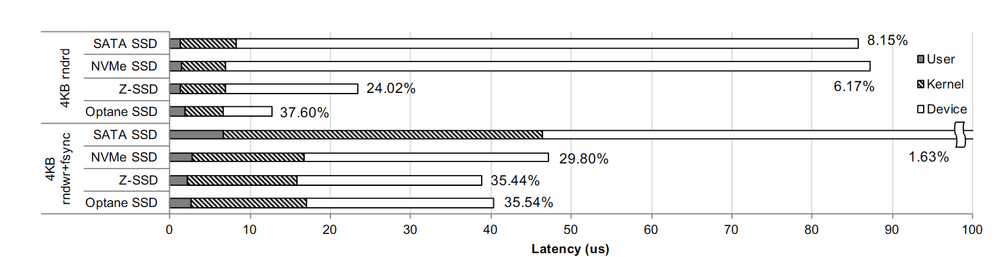
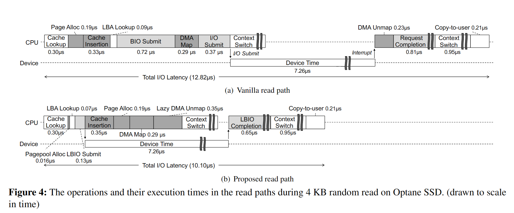
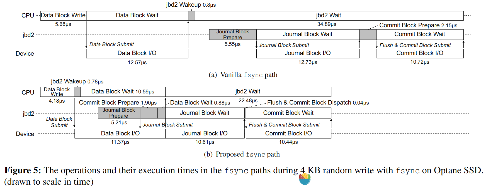

## Introduction

高速SSD设备的出现，显得原有的文件读写在内核路径上的开销变得不可忽略。

解决方法：
- 用户进程直接访问设备，但应用自身需要有块管理层，以及进程之间需要一定的保护。
- 优化原有的IO堆栈，使用轮询机制来避免上下文切换开销，在中断处理中移除下半部，提出分散I/O命令，简单块I/O调度。

介绍了当前Linux内核中在read path和write/fsync path的基本流程，发现可以将通过调整部分操作的顺序，将使得Device Operation和CPU Operation同时进行，减少了CPU的同步阻塞时间。同时还提出了一个轻量级的block layer层。

本文主要分析read和 write/fsync路径上的异步IO优化。

## Read Path

同步的操作：在内核提交IO请求之后，当前线程就会阻塞等待Device IO完成，同时切换到其他线程执行。

异步改造：
- Asynchronous Page Allocation/DMA Mapping：在提交IO请求之前，内核需要用页面分配器来分配空闲页面，这将消耗大量的CPU周期，在异步改造中，我们事先分配一个空闲的页面内存池，然后再Device IO时之前只需要执行Pagepool Alloc（该操作十分高效），然后提交Device进行操作即可。再Device操作时，CPU不会闲着，会用页面分配器补充之前使用掉的页面内存池。这样就将CPU的耗时操作和Device操作重叠起来，减少了该线程的等待时间。
- Lazy Page Cache Indexing：CPU中另外一个耗时操作是将分配的空闲页插入缓存索引中，同步路径的做法是在提交IO请求之前将page插入索引（这是因为可能会有其他线程在IO请求之前也会尝试插入缓存，失败了就不会发出IO请求，从而避免了相同的文件块有两份缓存的问题）。异步的做法是先提交IO请求，然后在等待IO请求完成时将page插入缓存索引中，这样可能会导致请求重复，这里的做法是允许重复的请求，在实现的时候，让一个页面与这个页面进行映射，其他的标记为废弃。
- Lazy DMA Unmapping：在同步路径中，一般是中断处理程序进行这个操作。异步路径将其延迟到系统处于空闲状态或者直到提交另一个IO请求之后。DMA解映射延后会带来DMA缓存区被延长使用的问题，如果没有恶意请求的话可以使用，用户也可以选择禁用。

## Write/Fsync Path

写入操作都是在内存中进行，不涉及阻塞等待Device IO，因此这里主要讨论的是 fsync path。

同步的操作：有两个IO准备操作：日志块准备和提交块准备。每个准备操作包括分配缓冲区页面，在日志区域上分配块，计算校验和以及块和设备驱动程序层内的计算操作。由于这些操作仅修改内存中的数据结构，因此它们不依赖于同一写路径中的先前I/O操作。

异步的操作：
- fsync系统调用时，应用程序线程首先发出脏数据页面的写回。
- 然后，它提前唤醒日志线程，以便将数据块I/O与日志线程中的计算部分重叠。
- 应用程序线程最终等待写回I/O的完成以及日志提交的完成。
- 在数据块I/O操作正在进行时，日志线程准备日志块写入并发出它们的写I/O。然后，它准备提交块写入并等待与当前事务相关的所有先前I/O操作的完成。
- 一旦完成，它向存储设备发送刷新命令，使所有先前的I/O操作变得可靠，并最终使用写穿透I/O命令（例如SATA中的FUA）发出提交块的写I/O。
- 完成提交块写入后，日志线程最终唤醒应用程序线程。

## 总结

1. 通过调整顺序和合并操作等手段，增加文件读写路径中的CPU和Device可以并行执行的任务片段，从而减少CPU上线程的阻塞时间。
2. 为什么叫异步：这里将读写路径分解成若干个子任务，在同步流程中，这些子任务需要同步执行，无法在CPU和Device上实现并行。这里通过对子任务的进一步拆解和合并，使得处理之后的某些子任务变得独立，不需要等待前者完成，因此在CPU和Device上可以实现并行。
3. 本文的主要工作是如何对具体的同步任务进行异步化处理，而对于异步化之后的调度，而对于任务的调度，这里其实不涉及。
