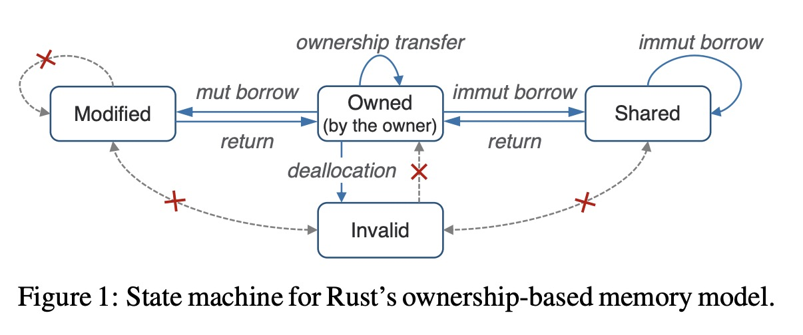
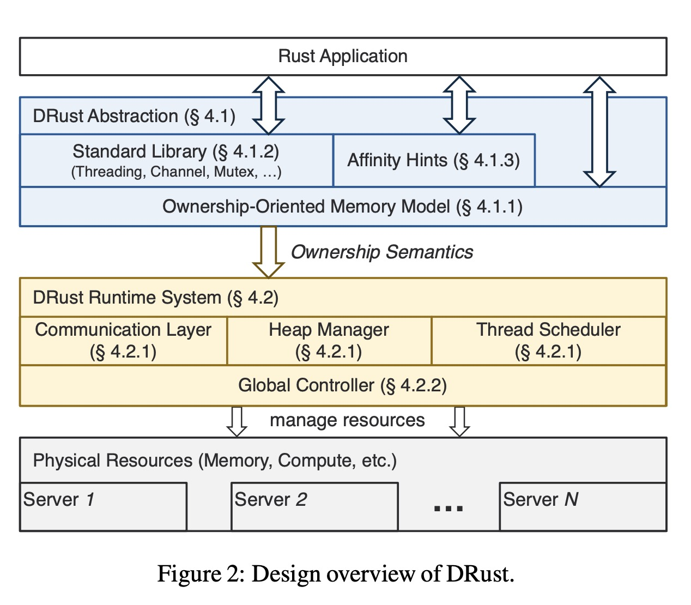

本文提出了一种基于Rust语言Ownership的DSM实现，该系统可以**自动约束读写顺序**，为简化一致性实现提供了机会。与现有的两种最先进的DSM系统GAM和Grappa相比，在吞吐量上分别提高了2.64倍和29.16倍，并且服务器数量增加时扩展性更好。

# Background

分布式共享内存（Distributed Shared Memory，DSM）是一种计算模型，它允许多个处理器或计算机共享一个统一的、连续的内存空间。有了DSM的假设，机器之间可以用相同的地址访问同样的内存数据，应用开发时不用考虑node之间传递信息，也不需要序列化与反序列化，实现完全不修改代码，也能将程序运行在多机上。由于DSM需要保证缓存一致性，**现有的DSM系统存在着性能、可扩展性的问题**。
- **同步带来的巨大开销**：为了保存缓存一致性，系统中存在大量的同步开销。每次读/写对象时，主节点都会跟踪其缓存块的状态，并根据状态变化更新所有缓存副本。
- 现有的DSM系统一般通过保证SWMR不变量来实现缓存一致性，即在同一时刻，要么有一份具有读写能力的数据，要么有多个具有只读能力的拷贝，现有的系统通过调用API来保证SWMR原则。

# DRust解决方案

作者观察到Rust语言中的Ownership机制和SWMR不变量存在共通之处：

- 每一个值在同一时刻只有一个Owner，
- 当Owner离开作用域时这个值就被丢弃了，
- 一个值的Ownership可以被传递/借用。

因此作者利用Rust的所有权抽象，重写了Rust的内存管理和std库，使得不需要更改Rust源码，就能让原有代码在DSM系统上运行。

