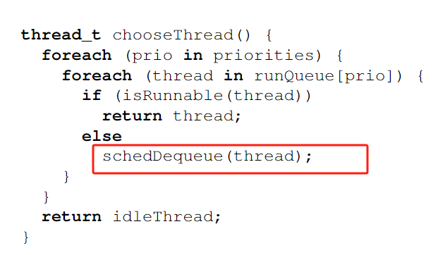
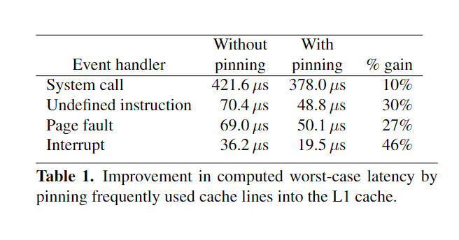

## 背景
RTOS kernel为了提升中断响应速度，在内核中几乎完全是可抢占的，这样会导致内核行为难以预测，难以进行形式化建模。

另一种可选的模型是让内核尽在特定的几个点可以被抢占，这样虽然无法获得前者的响应速度，但在CPU速率达到GHz的今天，这种延时是可以接收的。

本文探讨的是如何在保留seL4的形式化建模特点的同时，减少最坏中断响应延时。

内核的分类：
- 基于进程：每个线程都有自己的专用内核堆栈，保存内核的执行状态，便于实现完全抢占。
- 基于事件：使用单个内核栈，通过调度器来使得不同的线程有序使用内核栈。这种模型要实现内核抢占需要在抢占点保存
  - 线程下一次运行时应执行的函数。
  - 任何必要保存状态的结构。

seL4是基于事件的，最常见的操作（IPC）路径非常短，因此是不可抢占的，整个内核中对象创建和删除操作必然需要更长时间，因此可能需要开启抢占。

seL4中的被抢占操作实际上是一个可以重新启动的系统调用，在内核执行期间，硬件会禁用中断，并在遇到抢占点或返回用户时处理中断。在抢占点处，被抢占操作的任何必要状态都会被保存为 seL4 返回调用堆栈（？）。系统会留在只需重新执行原始系统调用的状态，就可以继续执行操作。

本文将探讨 seL4 中的一些长时间运行的操作，并研究如何添加适当的抢占点或用更好的算法替换这些操作。

## Areas of Improvement

### Removal of Lazy Scheduling

原始的seL4版本采用一种称为“懒惰调度”的优化，它观察到在 L4 的同步 IPC 模型中，线程在向另一个线程发送消息时经常阻塞，但在许多情况下，另一个线程会快速回复。在一个时间片内可以发生多次这样的乒乓操作，导致在运行队列中重复地出队和重新入队同一线程。

懒惰调度会导致调度器可能出现大量出队的操作，进而导致导致最坏情况下的性能糟糕。由于调度器负责确定下一个要运行的线程，为此添加抢占点既不可行，也没有意义。

为了保持懒惰调度的优势，使用Benno调度的算法：当线程被 IPC 操作解除阻塞并且根据其优先级可以立即执行时，我们会直接切换到该线程而不将其放入运行队列。

### Scheduler Bitmaps

使用两级位图来表示256个优先级，256 个优先级被分为 8 个“桶”，每个桶包含 32 个优先级。顶层位图包含 8 位，每个位代表桶中的 32 个优先级中是否有可运行线程。每个桶都有一个 32 位的字，每个位代表 32 个优先级中的一个。通过两次加载和两次 CLZ 指令，我们可以非常高效地找到最高可运行优先级，进一步减少调度器的内核路径。

### Aborting IPC Operations
seL4中的IPC可能阻塞了大量的线程，删除Endpoint操作必须遍历并出队所有的阻塞线程，最坏情况下可能会导致耗时过长。

这里明显的可抢占点就是每个线程被出队之后，

### Object Creation
当对象（如线程、页表或内存帧）以用户名义创建时，必须清除和/或初始化其内容，以避免信息泄漏。清除对象可能是一个长时间运行的操作，因为某些内核对象的大小可达数兆字节。

用于清除对象的代码之前位于对象创建路径的深处，并为每种类型的对象进行复制。此外，该代码在清除对象之前更新了内核的某些状态，并在清除对象之后更新了内核的其余状态。因此，在清除对象的中间添加抢占点将使内核处于不一致的状态。

为了使对象的清除具有抢占性，选择在修改其他任何内核状态之前清除所有对象的内容。清除的进度存储在对象本身中。由于清除是这些操作的唯一耗时方面，因此，操作代码中用于操作内核状态的部分（例如更新内核的记录数据结构）可以在一个短暂的原子传递中执行。

另一个耗时的操作时页目录（顶级页表）的创建。内核为其自己保留了顶部的 256 MiB 虚拟地址空间，并将其映射到所有地址空间中。当创建新的页目录时，该区域的内核映射必须复制进来。此复制操作嵌入在页目录的创建路径中。幸运的是在大部分现代处理器上可以使用“大页表”技术将页目录项缩小至几个。

### Cache Pinning

为了实现更快的中断传递和更严格的 seL4 最坏情况执行时间（WCET）， 本文修改了 seL4，将特定的缓存行（选择了中断传递路径，以及一些常用的内存区域）固定到 L1 缓存中，以确保这些缓存行不会被驱逐。

### 评估

## 想法
1. Cache Pinning的优化方法或许采用动态工作集的方式效果会更好。
2. 我们异步系统调用是否也需要设置抢占点，在此情况下，内核可能会停留相当长的时间，但如果采用seL4中重启系统调用的方式，那异步系统调用原本减少内核态和用户态的切换开销的优势就没有了。
3. 论文在强调增量编程，每一个修改都讨论了对原本形式化验证的影响，这个在我们的项目中被忽视了。