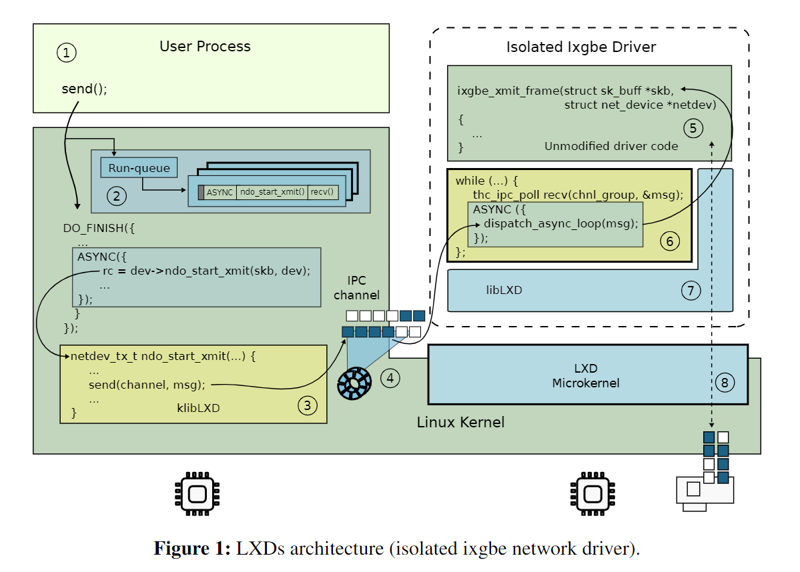
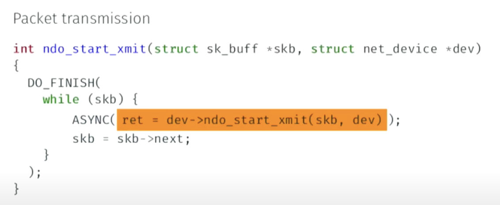

## 现状

- 现代操作系统包含了大量的驱动代码，内核变得过于臃肿。
- 驱动代码的大量涌入导致内核的安全性无法得到保障，大量bug被驱动代码引入。
- 之前有一些将驱动代码和内核代码进行隔离的工作，但是对内核代码和驱动代码都有较大的修改（无法保证向后兼容性）。

本文目标：
- 将驱动代码和内核代码按照一定机制进行安全隔离，使得驱动代码的漏洞无法威胁到整个内核。
- 确保对内核和驱动代码的较小、甚至没有改动，保证向后兼容性。

## LXDs Architecture

- LXD通过硬件虚拟化提供的隔离机制对Linux Kernel进行隔离，准确来说是对Linux Kernel和Microkernel进行隔离，同时也就隔离了运行在MicroKernel上的驱动程序。
- 驱动代码只需要重新链接胶水代码（图中6）和Microkernel的运行时代码即可在Microkernel上运行。
- Linux Kernel将胶水代码（图中3）当作驱动程序加载到内核中即可。
- 使用IDL自动生成的胶水代码（图中3和6）来隐藏驱动和内核不在同一个隔离域中的事实，实现消息的透明跨域传输，本质上是一个RPC层。

## 如何高效安全的实现RPC

- 安全（或者说保障隔离性）：驱动的隔离系统不会共享任何会打破隔离的状态信息（如内存指针等）。每个隔离子系统都维护自己的私有数据结构，通过胶水代码进行数据结构的同步。
- 高效：
	- 隔离之后需要涉及到大量的跨域RPC，这种耗时的RPC如果处理不当会导致系统的吞吐量降低，因此在LXD构建了一个小的异步运行时来隐藏这种开销(caller 等待响应时可以让权给其他异步任务)。
	- 为了减少上下文切换开销导致的RPC时延，LXD使用不同的子系统在不同的Core上来避免上下文切换。

### IDL

### Asynchronous Execution Runtime

提供两个原语 DO_FINISH 和 ASYNC。
- DO_FINISH：一个DO_FINISH块是一个异步执行器，对应一个Run Queue，只有队列中的所有异步任务都执行完之后才能退出DO_FINISH块。从外部看，DO_FINISH块的任务是同步的，但内部是异步的。
- ASYNC：创建一个协程任务，执行yield主动让权给另一个协程，同时将自己重新加入队列中。在从队列中选择一个协程任务时，检查reply ring查看是否有消息能够唤醒正在阻塞的协程，没有的话就切换到主协程或其他协程。
使用DO_FINISH的一个好处在于：对于非LXD的驱动，因为没有胶水代码（图中3），因此不会执行yield，所以是完全同步的，和原始流程保持了一致性，实现了向后兼容。

## Personal Thinking

1. 在Linux Kernel上运行一个微内核虚拟机，通过虚拟机和宿主机的隔离，来实现内核与驱动的隔离，那为什么不能直接用MultiKernel的思路对硬件进行划分，同时运行一个Linux Kernel和一个MicroKernel，直接实现物理上的隔离呢？
	1. 用VT-x技术实现虚拟化的开销已经很小，同时还提供了更好的扩展性（可以动态扩展微内核的硬件资源）。
	2. 原文已经提到了硬件隔离机制和LXD是正交的，因此我认为对于不支持VT-x技术的硬件来说，利用MultiKernel的想法来替换虚拟化，也是个不错的选择？
		1. 不行，硬件虚拟化提供了安全的隔离机制，而MultiKernel没办法阻止MicroKernel去攻击Linux Kernel。
2. 这里的DO_FINISH设计比较巧妙，在内部时异步执行的，从外部的整体看这个代码块时同步的。
3. DO_FINISH块只有内部是异步状态，当DO_FINISH块的异步任务少时，忙等状态会比较多（例如只有一个时，就退化为同步）。
	1. 容易想到的办法是建立全局的异步执行器，但是这样的话无法保证后向兼容性。
4.  从实验结果看来，只有当一个队列中有足够多的请求时（即用户态进行了批量请求，或消息过长，被分批发送）时，异步的好处才能体现出来。

