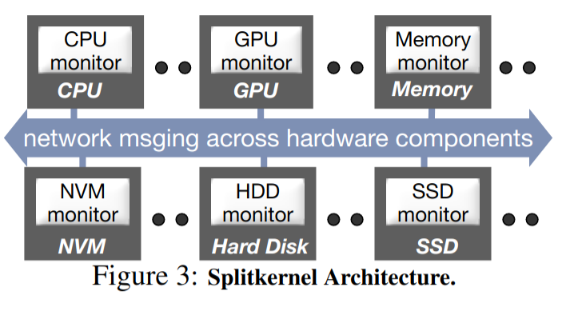
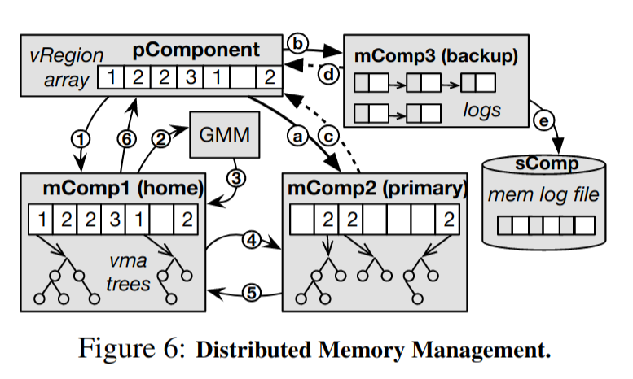

# 1 要解决什么问题
主要是当前数据中心的资源管理出现以下问题：
1. `低效的资源利用率`：非分布式应用程序只能运行在同一台物理机器上的CPU和内存中，导致资源使用不充分, 调研了Google和一个数据中心29天的利用率和阿里巴巴的一个数据中心的12小时利用率，CPU和内存利用率均只有50%左右。
2. `贫乏的硬件弹性`：当在整机中安装硬件组件后, 由于主板往往采用定制的形式,很难在往其中添加或减少新的硬件。
3. `粗粒度的故障域`：当服务器中的某个关键元件损坏后(如CPU 主板 内存 电源等)， 往往导致整个机器都无法使用, 包括其中完好的其他硬件。
4. `不能对异构进行有效支持的` ：当前服务器中不同型号的设备在主板上紧耦合在一起，当有新的硬件设备出现时，将其应用到数据中心是一个漫长的过程。

# 2 如何解决
## 2.1 几个假设
要解决以上几个问题，只有将整机完全打碎，分散成各个不同类型的设备进行管理。论文作者设想了一种硬件资源分解体系结构：传统服务器中的硬件资源通过网络进行连接而不是系统总线，每个硬件组件都有一个控制器和一个网络接口，可以独立的管理自己的资源，并且故障隔离。

上面设想的实现基于以下几个发展趋势和假设：
- 网络带宽和系统总线带宽基本持平甚至超越。
- 网络接口更加靠近硬件组件，这样硬件设备将可以直接访问网络而无需任何附加处理器。
- 硬件设备将结合更多的处理能力，允许应用程序和OS的部分逻辑功能下放到硬件。

## 2.2 SplitKernel OS Architecture
作者基于上一节设想的分布式硬件体系结构提出了一个新的OS内核结构，主要包含如下四个特征：

- 拆分OS功能体：把传统OS功能单元拆分成　`monitor` ，每个 `monitor` 管理一个硬件组件，`monitor` 之间是松耦合的，通过通信来访问远程资源，同时使用无状态设计来实现最小状态共享或元数据共享。

- 在硬件组件上运行 `monitor`：在非处理器的硬件组件（如内存、磁盘等）上有一个控制器可以运行 `monitor` 程序，这个控制器可以是低功耗的通用核心。每个 `monitor` 可以在约定的接口下使用自己的实现来管理硬件资源，这样对于新出现的硬件，开发者只需要实现对应的 `monitor` 来管理资源，并连接网络即可完成适配。

- 跨组件的非一致性消息传递：与其他分布式系统所依赖的一致性互联不同，SplitKernel的通信运行在通用网络层（如 `Ethernet`），并且为了减少网络带宽消耗不提供缓存一致性。当然，这里依然保留了硬件本身提供的一致性保证，而用户程序需要通过消息通信自己来保证所需要的一致性。（？操作系统本身不需要一些数据一致性的保障吗？）

- 全局的资源管理和错误处理：除了 `monitor` 管理自己的硬件资源外，SplitKernel还需要一个全局的资源管理，和错误处理来避免某个硬件组件挂掉导致的所有涉及到的任务失败。为了减小性能消耗，全局管理只是偶尔的和粗粒度的。

## 2.3 LegoOS
`LegoOS` 是论文作者实现的一个 `SplitKernel` 架构的分布式操作系统。

### 2.3.1 Usage Model
`LegoOS` 对用户暴露了一群虚拟节点 `vＮode` ，在用户看来，一个 `vＮode` 就是一个虚拟机，多个用户可以在同一个 `vNode` 上操作，也可以在一个 `vNode` 上运行多个任务，同时，一个 `vNode` 可以运行在多个组件上，一个组件上可以同时有多个 `vNode` ，这些执行状态对用户都是透明的。

由于 `SplitKernel` 的设计原则中包含不提供跨组件的一致性保证，因此 `LegoOS` 不支持跨进程的可写共享内存，`LegoOS` 假设只在同一进程下的线程中共享内存，而应用程序使用跨进程的可写共享内存需要通过消息通信来保证一致性。

最后，`LegoOS` 将支持Linux的基本系统调用和ABI，可以运行在Linux上的分布式应用程序同样可以运行在 `LegoOS` 上。

### 2.3.2 Hardware Architecture
`LegoOS` 主要将硬件组件分为3类：处理器，内存、和存储，分别对应三种 `component` : `pComponent`（CPU）、`mComponent`（DRAＭ）、`sComponent`（SSD or ＨDD）。

- 分离处理器和内存功能：`LegoOS` 将所有的硬件内存功能都放到 `mComponent` （如页表，TLB），只在 `pCompenent` 中留下了一部分缓存内存（用于提速），所有的内存操作对 `pComponent` 是透明的。
- 处理器虚拟缓存：这里由于引入了 `Vritual Cache` , 会导致 `homonym problem`，通过 `ASID` 解决。
- 扩展缓存：利用局部性原理，在 `pComponent` 中保留一部分内存 `ExCache` 来提高性能。这里的 `Cache` 位于 LLC和跨组件内存之间的层级结构。每个扩展缓存行由一个指示虚拟地址的 `tag` 和两个访问权限位控制，这些由OS来进行设置，而设置一个硬件缓存控制器负责通过虚拟地址来fetch对应的缓存行，如果fetch失败，再转由OS处理。（不是很懂，如何区分不同进程的虚拟地址？）
- 在 `pComponent` 中还保留了 `LegoOS` 内核所用到的内存数据本身，确保可以直接通过物理地址访问内核数据。

### 2.3.3 进程管理
当一条新的进程出现时，LegoOS使用全局策略选择一个pComponent负责该进程的执行。在该pComponent中，monitor找到负载最小的CPU core执行该进程。而进程所生成的其他线程，都将挂载在进程所在的 `pComponent` 上。

当CPU访问ExCache出现miss时，根据信息使用RPC从相应mComponent中获取数据并写入某ExCache行。若ExCache已满，使用FIFO或LRU策略替换ExCache行。

同时，为了兼容Linux中有状态的系统调用（如open file等）， `LegoOS` 在 `process monitor` 上新增一层用于存储和转换这些状态。

### 2.3.4 内存管理

所有mComponent的内存单元组成一个虚拟地址空间。一个应用程序可以申请多个mComponent的内存空间，其中有且仅有一个mComponent称为该应用程序的`home mComponent`，作为该程序的内存优先分配。当一个新进程出现时，`LegoOS`使用全局内存管理(`GMM`)指定该进程的`home mComponent`。

虚拟内存空间被分割为若干固定大小的虚拟区块，称为`vRegion`。若某`vRegion`已被分配，则称为`active vRegion`。每个`vRegion`有一个mComponent作为它的owner，表示该`vRegion`的物理位置在该mComponent中。vRegion可以进一步细分为若干virtual memory area(`vma`)。

所有mComponent都保存一个数组vRegion array，该数组指出所有vRegion的分配情况以及其owner编号。若vRegion的owner为该mComponent，则额外保存一个vma tree，用于保存vma的信息。

应用程序的一次内存分配申请流程如下：pComponent接到内存分配请求后，向`home mComponent`(mComp1)发出请求(①)，若mComp1没有足够的空间，则向GMM请求帮助(②)。GMM找到合适的mComponent(mComp2)并告知mComp1(③)。mComp1向mComp2发送内存分配请求(④)，mComp2分配内存空间后向mComp1回复完成(⑤)。mComp1向pComponent回复分配完成通知(⑥)。

pComponent保存了home mComponent的vRegion array的副本，此后可以直接根据数组信息访问对应mComponent (a,c)。LegoOS在mComponent中为每个vma设置了log，记录数据变化情况。为了增加容错性，vma的log除了在本地mComponent(primary)保存，还在另外一个mComponent(secondary)保存，同时在某sComponent中也进行了存储。若primary mComponent故障，secondary mComponent可以根据log重新执行一遍操作，恢复该vma的内存数据。

这里LegoOS引用了一项内存分配的优化技术。当应用程序申请内存分配时，仅在本地的ExCache分配该空间(p-local lines)，作为临时内存空间。只有当此p-local lines需要被置换出ExCache时，才实际地在某mComponent中分配内存并写入该数据。这种方式大大降低了内存分配申请操作需要的时间。

### 2.3.5 存储管理
LegoOS 在 sComponent 中实现了核心的存储能力，它通过 vNode 的抽象向后兼容了 POSIX 并支持了具有多个层级的文件接口，用户可以在 vNode 挂载点中正常存储目录和文件等数据并执行正常的读写和其他操作。

为了保证文件系统的简单，论文作者在 sComponent 中应用了无状态的设计，所有的 I/O 请求必须包含该请求所需要的全部信息，而 LegoOS 的存储监视器也选择使用哈希表来存储文件名到文件的映射，这也可以减sComponent 查找文件时所需要的计算资源，最大化的分离 CPU、内存和存储资源。

因为不仅要分离内存和存储资源，还要保证存储的访问速度，操作系统原本的存储缓冲区(`Storage Buffer Cache`)也被放到 mComponent 中。当 pComponent 想要读取存储节点中的数据时，它会先从 mComponent 中查找是否有缓存的数据，只有当存储缓冲区中不包含对应数据时，它才会调用 sComponent 的接口获取数据并将数据写入 mComponent 的缓冲区中。

### 2.3.6全局资源管理
关于全局资源管理，LegoOS设置了GPM, GMM, GSM分别对pComponent, mComponent, sComponent进行管理。全局管理只进行粗粒度的资源分配和负载均衡，细粒度分配交给相应Component的monitor。全局管理会定期地与所有对应的Component进行通信，以获取其当前计算/存储负载，从而在执行分配时选择合适的Component。
- 当创建一个新进程时，`GPM`会选择一个挂载了最少的线程的 `pComponent` 并在本地分配一个线程。
- 当 `home mComponent` 项`GMM`发送分配一个新的 `vRegion` 请求时，`GMM`会选择一个负载最小的 `mComponet` 进行分配。

这些负载信息都是通过全局管理定期与各个 `Component` 通信得到的。

### 2.3.7 可靠性和错误处理
- 内存可靠性：由于一个应用程序的内存可能分配在多个 `mComponent` 上，如果不处理错误，任何一个 `mComponet` 出错都会导致应用程序执行失败，这比在整机上更加频发。
- 存储可靠性：这将有各个现代的分布式文件系统进行保证，这里没有讨论。
- 进程可靠性：`LegoOS` 没有将一个进程跨 `pComponent`，因此一个应用程序在处理器出错的概率和整机在处理器出错的概率相当。这里没有处理。

因此，这里主要讨论了如何处理 `mComponent` 的错误。LegoOS在mComponent中为每个vma设置了log，记录数据变化情况。为了增加容错性，vma的log除了在本地mComponent(primary)保存，还在另外一个mComponent(secondary)保存，同时在某sComponent中也进行了存储。若primary mComponent故障，secondary mComponent可以根据log重新执行一遍操作，恢复该vma的内存数据。

# 3 个人思考
1. 这种设计是如何解决第一章所提到的四个问题的？
	- 低效的资源利用率：这种设计将一个进程的内存分配分配到各个 `mComponet` ，使得内存的利用率有效提高，同时，将CPU和内存的物理机分离，也能有效的提高利用率。
	- 贫乏的硬件弹性：当某项资源不足时，只需要增加相应的资源组件即可，无需更改之前的设备。
	- 粗粒度的故障域：某一个硬件组件的故障不会影响其他任何组件。故障域缩小到某一个硬件组件。
	- 不能对异构进行有效支持的：当出现一个新的硬件设备时，开发者只需要实现对应的 `monitor`来管理自己的资源，并接入网络即可完成适配。
2. 没有实现进程的跨 `pComponent` ，使得CPU的利用率还不够，是由于操作系统没有提供跨组件的缓存一致性，如果不同的 `pComponent` 里的Cahce不一致，会产生很多问题。
3. 没有跨组件的一致性保证，那为什么在 `mComponent` 上设置 `Storage Buffer Cache` 能够正常工作，不会有一致性冲突吗？
4. ExCache的一致性如何保证？写回传保证缓存和主存间的一致性，而作者在论文中说了，不支持可写的跨进程的共享内存，而且论文中一个进程不会跨 pComponent，所以主存只会有一份Cache在远端，不存在远端之间的一致性问题。
5. 进程内的虚拟地址是如何转换的，还不太理解？