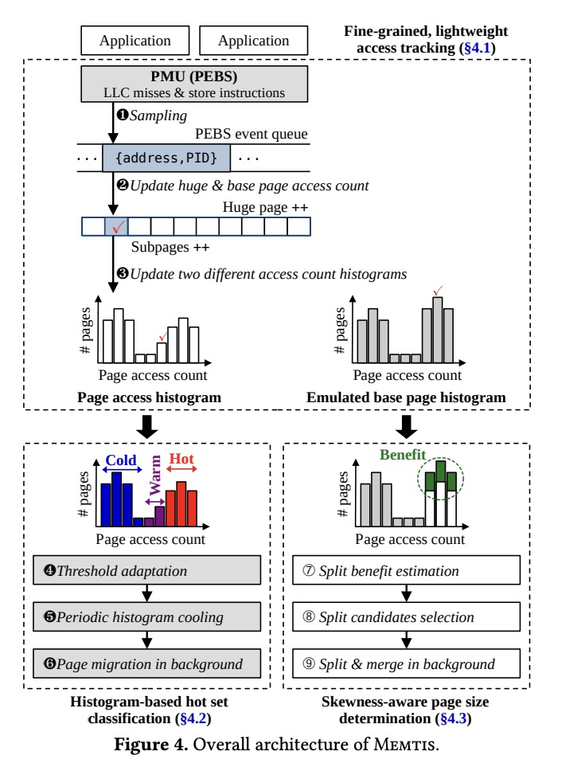
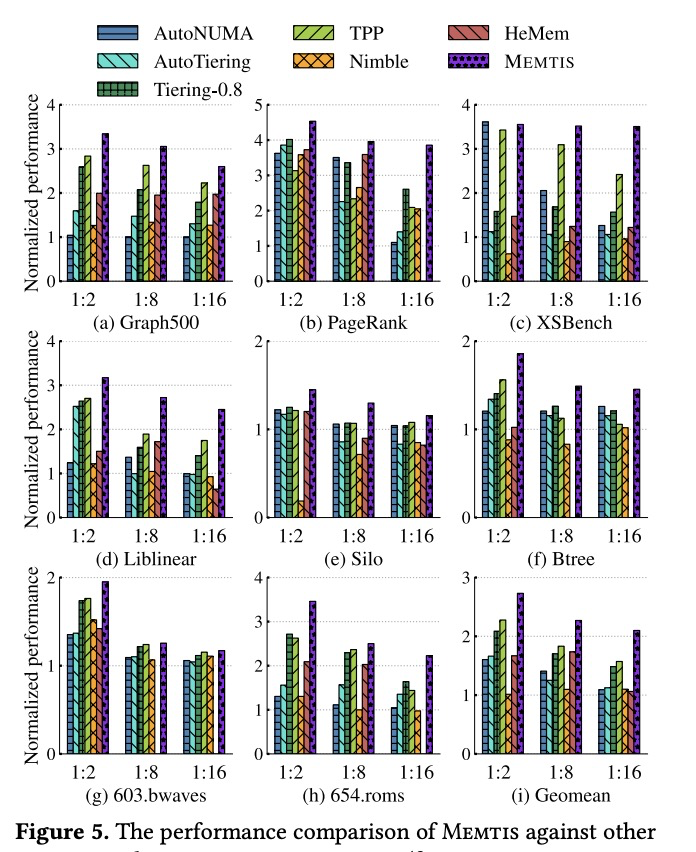

# Background

之前关于内存分层的工作往往无法做出最优的页放置决策，因为它们依赖于各种启发式方法和静态阈值，而没有考虑整体的内存访问分布。此外，为应用程序确定合适的页大小也很困难，由于内存访问并不总是均匀的，使用大页不一定能得到正向收益。

此前的分层内存系统利用 page fault，PT scanning，hardware-based sampling等方法进行访存追踪。然而基于page fault的系统会显著增加内存访问的 latency，基于PT scanning的系统的可扩展性较差，基于硬件sampling 的工作无法追踪 subpage access。

# Design

本文提出Memtis，一种利用informed decision-making机制来制定页大小和页放置策略的分层内存系统。Memtis利用已分配页的访问分布，以最优的方式逼近热数据集的fast tier capacity。

Memtis 主要解决三个问题：
- 如何使用基于硬件的内存访问采样，以细粒度和轻量级的方式跟踪内存访问：使用Processor Event-Based Sampling (PEBS) 对内存访问进行采样。由于PEBS样本包含精确的内存地址，使得Memtis可以支持细粒度的访问跟踪。在Memtis维护一个内核后台线程（ksampled）来处理采样的地址，Memtis可以动态调整访存采样频率，确保CPU开销在阈值(< 3%)以下。
- 如何根据整体内存访问频率分布，动态准确地确定热页和冷页：Memtis使用page access counts来维护所有已分配页面的热度分布，并且利用该数据做出最佳的memory tiering决策，将最热的页放置在fast tier以最小化访问延迟。
- 如何动态确定页大小(大页与普通页)，以在不浪费fast tier 内存的情况下降低转换成本：在Linux中默认使用Transparent Huge Pages(THP)来减少地址翻译的开销。使用ksampled维护的emulated base page histogram来估计仅使用普通页时的最大命中率，并将估计的最大命中率与从PEBS的采样记录中获得的实际命中率进行比较，以此来估计拆分大页的潜在收益。如果潜在的好处很大，Memtis会选择子页面中访存模式最不均匀的大页作为拆分候选页。然后，在后台对大页进行拆分，并根据大页中维护的子页访问信息将每个分片后的子页放置到相应的内存层。

# Implementation

作者实现MEMTIS在linux kernel 5.15.19。更改代码总行数LoC为5166。

作者利用Linux kernel的_compound_page_ 结构管理huge page的访问元数据。_compound_page_ stucture包含512个_struct_ pages，每一个都是4KB物理页frame的元数据。Linux kernel使用前3个struct page来描述huge page本身的信息，剩余的使用。作者利用未被使用的_struct_ page（3-131）来存储huge page访问元数据（3），subpage 访问元数据（4-131）。通过这种方式MEMTIS管理huge page和其subpage的元数据没有其余额外的内存开销。

存储base page的访问元数据有点棘手，因为在用于page cache和匿名页的_struct_ page没有未使用的空间。没有在struct page中添加一个额外的字段，这会造成size大于64B一个cache line，作者利用了一个页表的PTE page frame。因为PTE page frame的struct page有一个未使用的8字节的padding空间，作者把这个未使用的字段作为一个指针指向了一个4KB的元数据页，该页面包含了512个base page的512元数据条目。最坏情况下，所有的页面都是base page，MEMTIS内存开销最多为memory footprint的0.195%。
# 测试

下图展示了使用NVM作为容量层时分层内存系统的性能比较。Memtis几乎在所有情况下(23/24)都表现最佳，特别是在geomeanbenchmark 下的性能比次优系统高出33.6%。实验结果表明，Memtis在各种内存设置和访问模式下均表现良好。

