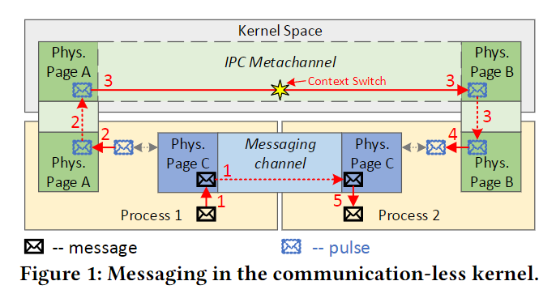
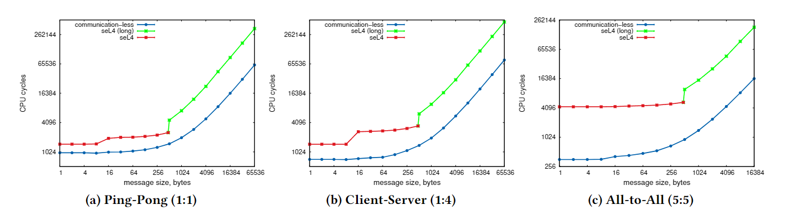

## 背景
 1. 第三代微内核强制使用同步通信作为主要的通信方式，通过IPC系统调用进行任务切换，对于基于多服务的微内核系统而言，大量的IPC仍将导致大量的任务切换。
 2. 第三代微内核提出的Fast IPC致力于减少单个IPC的时间开销，而忽略了从应用层减少IPC（任务切换）的数量。
 3. 第三代微内核中的IPC与任务调度紧密耦合且功能有重叠，有悖于最小化原则。

基于上述原因，作者反向思考，与seL4中IPC驱动任务切换相反，提出用任务切换来驱动IPC，在多服务的微内核系统中，尽量在一次任务切换中传递多个IPC消息，从而相对减少了单个IPC的任务开销。此外，作者完全使用共享内存的方式在用户态实现了IPC，将IPC从内核中去除，简化了内核设计。

## Design

- API: 不提供传统的 Send和Recv系统调用，内核仅提供IO管理、内存管理和调度的功能，提供一个equilibrium() 系统调用阻塞当前线程来请求切换，同时内核调度支持基于时间片的强制切换。
- Message Channel: 两个用户态任务之间的共享内存，通过内存管理的相关接口进行建立，是异步IPC的数据面通道。
- IPC Metachannel: 用户态和内核态的一片共享内存，当用户态任务将发送数据写入对应的Message channel之后，再往对应的 IPC Metachannel写入发送的控制数据（如接收端编号等），当前任务陷入内核态（主动调用equilibrium或被时钟中断强制切换）时，内核会检查对应的Metachannel，唤醒对应的接收端任务。IPC MetaChannel是异步IPC的控制面。

1. 两个任务约定一个统一的传输协议用于解析Message Channel的数据，process 1往message channel写数据，这时的数据会立刻出现在process 2的虚拟地址空间中。
2. 但是 process 1 无法保证 process 2 一定处于运行或将来的某个时间段一定可以运行，因此需要向 meta channel中写入一个pulse。
3. 当process 1被切换掉时内核会检查对应的meta channel，以确保process 1对应的接收端（process 2）都处于运行态或就绪态。
4. 当Process 2 运行时，会从meta channel中接收到对应的pulse，表示有消息到达，在用户态主动从message channel中读出数据。

## Performance

## Personal Thinking

1. 性能只展现了消息传输所占的CPU周期，没有展示每个消息的时延，使用异步的批量传输可以减少平均每个消息的对应的任务切换开销，但是对消息的实时性可能有一定影响。
	1. 要保证某些消息的实时性可以在发送之后主动调用equilibrium，以达到同步传输的效果。
2. 在多核环境下，如何保证正确性？
	1. process 1 在CPU 1发送消息之后，process 2 正好在CPU 2 上调度，读到了process 1发送的数据，然后被CPU2切换掉，但此时process 1仍将向meta channel发送Pulse来尝试唤醒 process 2，而process 2已经读到了对应的数据，唤醒之后也没有数据可读，因此唤醒process 2这次任务切换将被浪费掉。