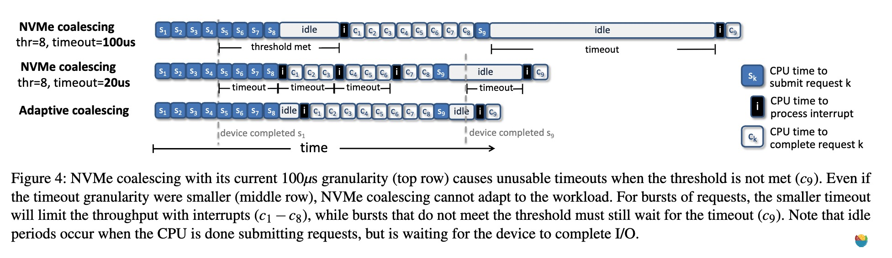
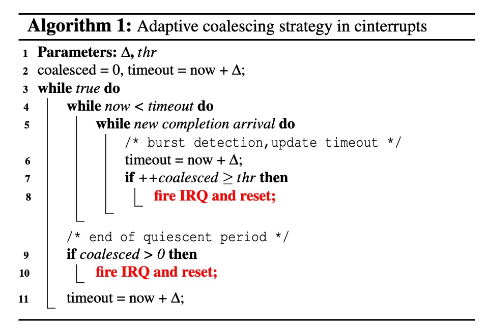
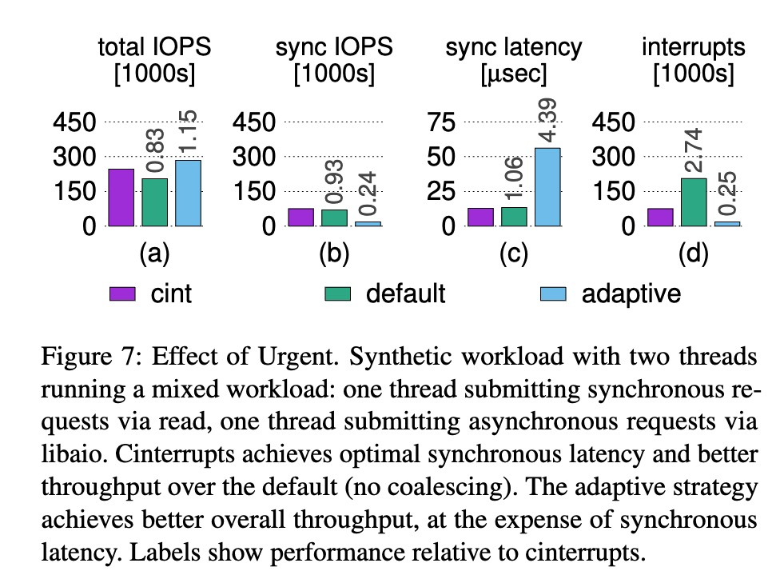
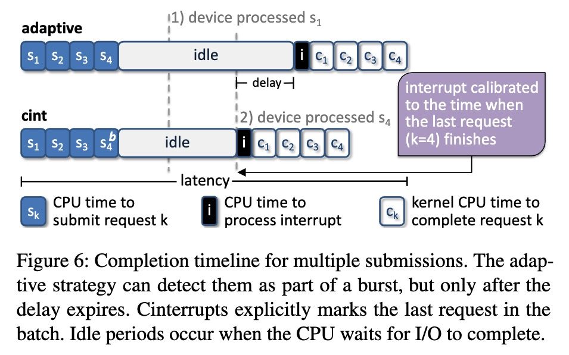
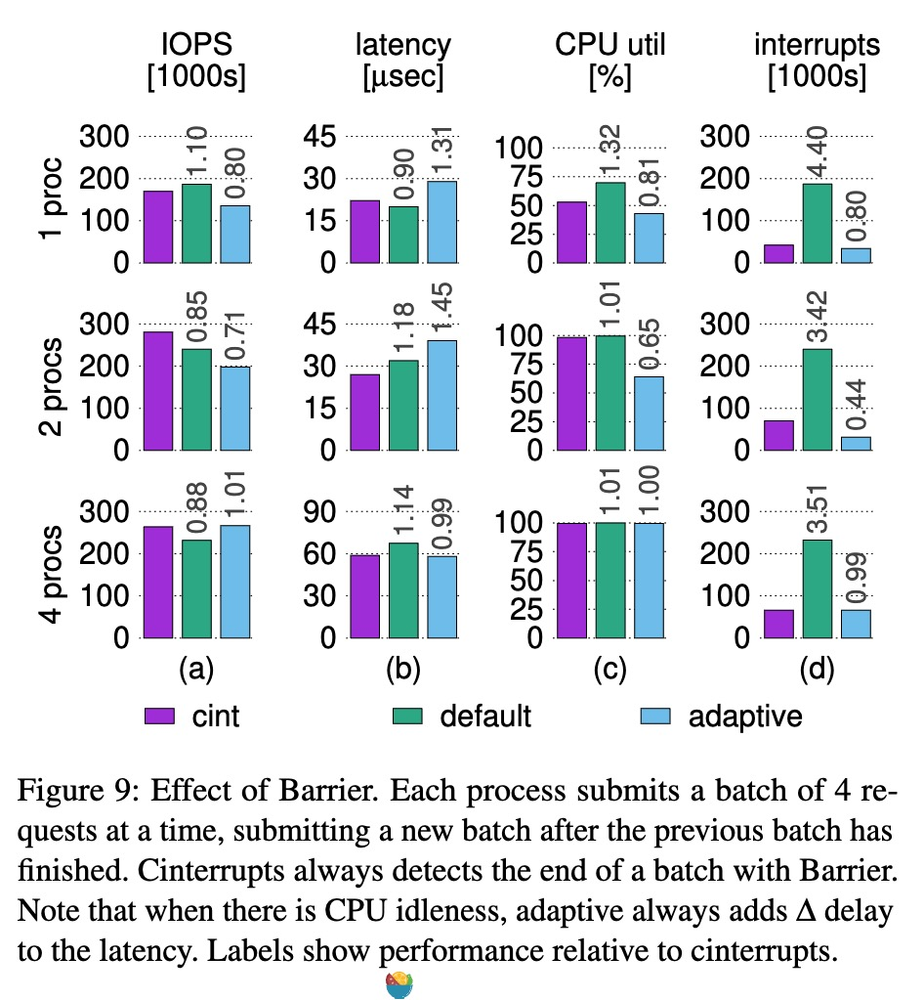
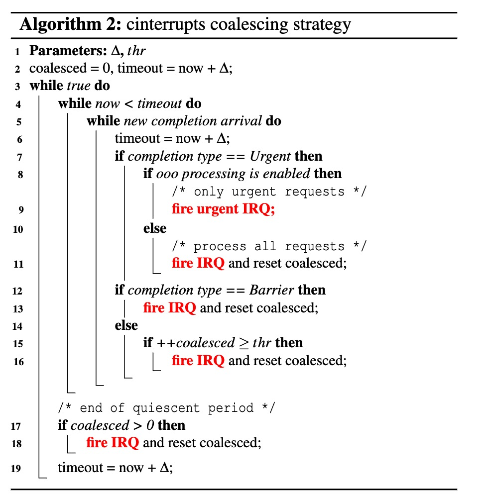

# Abstract

立即中断可以最小化延迟，中断合并可以提升吞吐量。设备使用启发式中断合并算法来平衡两个目标，但是由于设备缺乏IO请求是否是延迟敏感的语义信息，这些启发式算法可能会导致糟糕的性能。

本文提出的方法允许软件显式指定IO请求是否为延迟敏感的，设备根据信息来调整中断处理行为。

# 背景

- 中断：NVMe允许应用每秒提交百万个请求，还提供65535个并行的请求队列，这些并行的请求队列如果每完成一个请求就发起一个中断，将导致中断风暴。
- 中断合并：将多个完成请求合并，当数据包达到一定阈值或超时时，发起一次中断来避免中断风暴。然而NVMe规范中对于聚合时间的设置限制导致了对低延迟请求的显著延迟增加。而且静态配置，无法应对变化的工作负载。
- 轮询：软件主动查询待处理的数据包，而不是等待通知，拥有最低的延迟，但需要消耗大量的CPU周期。
- 混合轮询：这种基于启发式的技术通过在开始轮询前休眠一段时间来减少轮询的CPU开销，也是不充分的，在请求大小变化的情况下会失效。
- 启发式完成机制：vIC依靠 `commands-in-flight` 的数量来确定是否合并中断，同时还采用平滑机制来确保合并率不会发生剧烈变化，为了防止在低负载场景下延迟增加，vIC还在提交率低于某个阈值时消除中断合并。However，缺乏将中断传递与应用程序语义对齐所需的信息。
- 暴露应用层语义：cinterrupts通过向系统调用接口增加几位来增强其功能，以便应用程序可以将信息传输给内核。Cinterrupts进一步将此信息与设备共享，由设备来决定发起中断的时机。

# Cinterrupts

## Adaptive Coalescing

总结一句话：只要这些请求的到达时间间隔在某一范围内，设备应该为一系列请求（或称为请求突发）生成单个中断。

第6行进行冲突检测，当有新的完成操作到达时，则将超时时间推后 $\Delta$ 。同时为了限制延迟，自适应算法设置了一个阈值（$thr$），当操作数达到阈值之后将发起一个中断。同时，当超时之后如果没有完成操作，则不发起中断并重置超时时间。

## Urgent

自适应策略可以准确地检测到突发情况，尽管它需要增加 $\Delta$ 延迟来确认突发的结束，但这是由于设备无法获取足够的信息，因而无法避免的。

“Urgent”注释用于为单个IO请求请求中断：设备将为标记为“Urgent”的任何请求立即生成中断。Urgent的主要用途是使设备能够为延迟敏感型请求校准中断。Urgent消除了自适应策略中的延迟。

## Barrier

为了对一批请求进行中断校准，cinterrupts使用了Barrier注释，它标记了一个批次的结束，并指示设备在所有前面的请求完成后尽快生成中断。

与Urgent的区别：一旦Urgent请求完成，就会立即生成一个Urgent中断，而Barrier中断可能需要等待，如果请求不是按顺序完成的话。

## Out-of-Order Urgent

我们注意到，Urgent请求有时与其他请求一起完成，这增加了它们的延迟，为了解决这个问题，cinterrupts实现了乱序（OOO）处理，这是一种针对Urgent请求的驱动级优化。通过乱序处理，IRQ处理程序将只在中断上下文中收集Urgent请求，这使得Urgent请求能够更快地返回给用户空间。

乱序处理（OOO处理）的影响是增加了生成的中断数量。图12报告了与图8中相同的混合工作负载的性能指标。乱序处理生成的中断数量是原来的2.4倍，从而将同步请求的延迟减少了近一半。额外中断的影响体现在异步IOPS数量的减少上。

## 总结

1. 传统的中断合并超时时间过长，且显著增加了同步IO的延迟，且超时时间和阈值静态配置。自适应算法可以动态调整超时时间，大大减少了同步IO的延迟。
2. 在混合型工作负载中，自适应算法对延迟敏感型请求依然不够用，Cint 通过增加两个标志位来帮助设备分辨延迟敏感型请求。
3. 在当前的异步IPC的用户态中断使用机制，也是一种自适应算法，但对于发起中断的频率取决于收方的处理速度。