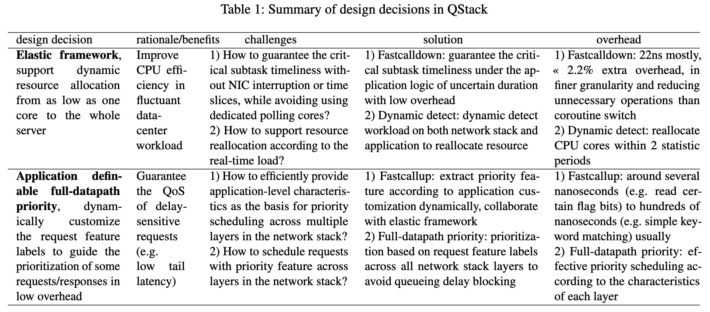
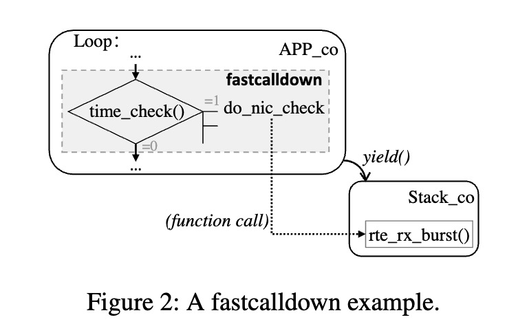
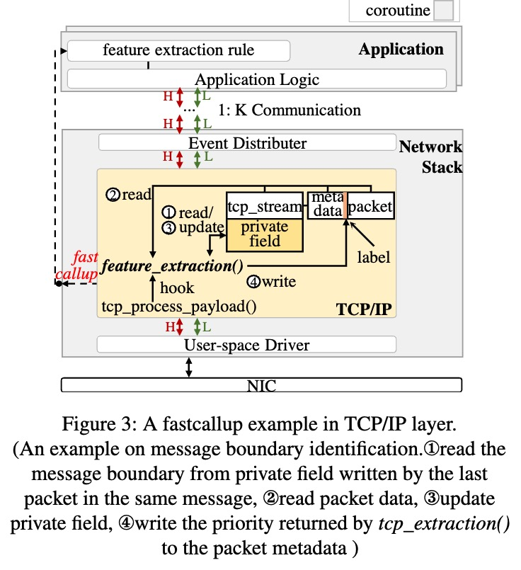
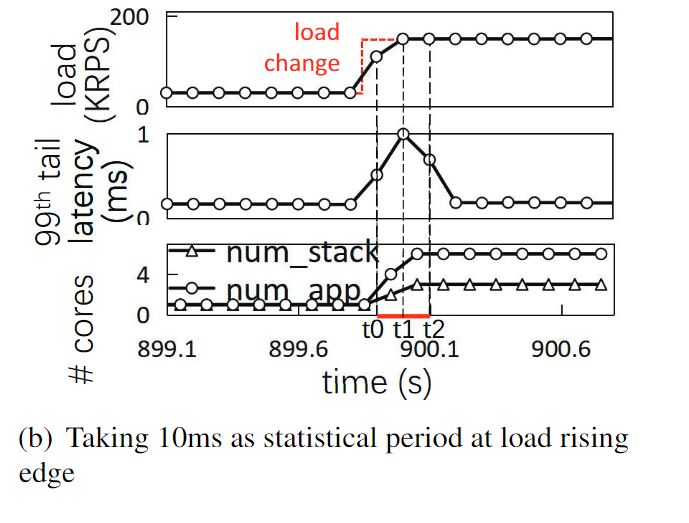
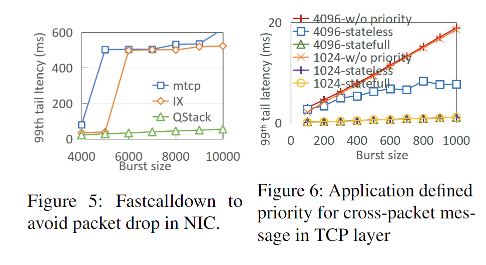

## 摘要

TCP/IP网络堆栈对于Web服务在数据中心前端服务器上是不可或缺的，尤其是随着新兴的高并发网络服务应用（包括互联网、物联网、移动互联网等）的迅速增长，其需求也在不断增加。现有的网络堆栈方案往往面临着数据中心服务器资源利用率（即高CPU效率）和应用服务质量（即低尾部延迟）之间的两难困境。本文通过一种灵活的架构设计QStack打破了这一困境，该架构在用户空间网络堆栈中灵活地平衡了CPU效率和低尾部延迟，适用于前端数据中心服务器。QStack提出了弹性资源框架和应用可定义的全数据路径优先级，从而实现了CPU核心之间的网络堆栈协作和网络层之间的细粒度垂直协调。

## 背景和动机

- 背景：
	- “The secret to 10 million concurrent connections – the kernel is the problem, not the solution”。传统观念认为，基于内核的网络堆栈有其巨大的开销，不适合高并发的工作负载。
	- 现有的用户态网络协议栈通常不符合独立调度的要求，而是在调整CPU资源分配时与应用调度相关联，以适应应用特性。
		- 要么为网络协议处理分配固定的CPU核心，要么将网络和应用逻辑作为一个整体单元进行绑定，考虑到数据中心变化的工作负载，这种静态分配可能会导致CPU效率低下或尾部延迟不佳。
		- Shinjuku、Perséphone和Shenango 将它们的网络堆栈运行在一个或几个专用的CPU核心上：如果入站网络工作负载较轻，则由于忙轮询而浪费CPU资源。如果网络工作负载较重，则当前CPU核心可能不足以以期望的延迟处理峰值工作负载。
		- mTCP、IX、ZygOS和F-Stack 在每个CPU核心上以静态耦合模式专门分配网络堆栈和应用计算：虽然这种设计提高了数据局部性，但如果应用程序需要处理的工作量很少，则会导致CPU效率低下，或者如果应用程序逻辑占用更多CPU周期而网络堆栈正在等待关键处理，则会导致尾部延迟增加，甚至在NIC上出现丢包情况。
	- 现有的网络协议栈平等地处理网络请求，即先到先服务。虽然这种方式可以在一定程度上提高CPU效率和降低尾部延迟，但当每个请求的服务时间差异显著时，它并不是最优的。
		- 一个常见的问题是队首阻塞，即一个关键且运行时间短的请求可能会被之前运行时间长的请求阻塞。虽然可以通过采用抢占和任务窃取等策略部分解决这一问题，但这些方法只有在应用程序性能已经恶化时才会被触发，并且它们会引入更多的开销。
- 动机：
	- 弹性框架：
		- 网络协议栈与应用程序的分配关系：处理高并发负载的前端服务需要足够的CPU资源来确保网络堆栈的及时处理。后端低延迟服务需要将同一请求的应用程序处理和网络堆栈处理放在同一核心上，以提高缓存局部性。批量应用程序则需要为上层应用程序处理分配足够的计算资源，并将它们放在单独的核心上，以避免与网络堆栈和其他应用程序处理产生干扰。
		- 此外，数据中心负载的波动导致网络堆栈处理和应用程序处理对CPU资源的需求随时间变化，网络堆栈需要能够动态地调整CPU分配。
		- 总之一句话，网络协议栈为了应付不同的负载要求，需要灵活地运行在不同的时间和空间下。
	- 从应用层提取特征进行调度。工作负载特性通常在应用层最为丰富和直观，而网络堆栈的全局视图将是提取特征的最佳位置。因此，理想的情况是，我们能够从应用层定义负载特性，然后在网络堆栈处理窗口中尽快完成特征识别。

## 设计与实现

### Elastic Framework

主要解决两个问题：
- 如何避免当应用与网络协议栈共享核心时，应用长时间处理而导致的网络包被阻塞甚至丢包的情况？
- 如何根据实时负载检测和重新分配资源，以及如何平滑地调整网络堆栈、NIC队列和应用逻辑之间的协作？

#### Fastcalldown

QStack在用户态提供 fastcalldown 接口，当触发fastcalldown接口时会获取系统时间，并检查NIC check interval 是否超时，超时则调用网卡接口接收网络包；检查TCP process interval是否超时，超时则调用网络协议栈接口处理网络包。当然也可以检测当前运行的应用协程是否超时，是否需要切换出去。

fastcalldown的触发时机主要有两个：
- 隐式调用：会在系统库接口中隐式插入，如epoll_wait(), recv(), send()等。
- 显式调用：当应用处理时长不确定时，开发者需要以一定频率显式地在代码中插入fastcalldown调用来确保网络包能够及时被接收和处理，在未来的工作中，或许希望用编译器自动识别合适的代码点进行自动插入。

大多数情况下，快速调用只是获取当前时间，检查时间戳，然后返回以继续执行，直到需要调度为止，其开销约为22纳秒。以Intel NIC 82599为例，检查一个空队列大约需要100纳秒，而批量处理32个数据包大约需要1微秒。在极端情况下，对于10G线速的64B数据包，填满一个长度为4096的NIC队列需要超过200微秒。然而，QStack通常使用多个队列来接收数据包，因此，以200微秒作为接收数据包的阈值，绝对可以确保不会丢包。假设快速调用的插入操作以微秒间隔执行，那么额外的开销大约为2.2%，但在实际场景中，这个比例会低得多。

#### Dynamic detect

针对数据中心中波动的工作负载，QStack使用资源管理器（在无应用和网络堆栈的核心上运行）来监控网络堆栈和应用的实时负载，并动态制定CPU资源分配策略，动态调整应用和网络堆栈协程的数量，以及管理QStack使用的CPU核心数量。

为了支持应用和网络堆栈的动态资源调整，QStack在上层使用基于MPSC（多生产者单消费者）队列的K:M并行和无锁通信框架，实现应用和网络堆栈之间并行、动态和高效的通信和任务分发；在下层，QStack使用Intel RSS哈希得到的TCP流组，实现网络堆栈和NIC队列之间低开销的动态关联。

QStack包含一个简单的默认调度器，它可以挂起、唤醒或迁移协程/线程到指定的核心，并以轮询的形式调度所有应用协程。调度器可以通过指定接口获取当前应用协程对应事件队列中的积压事件数量，并计算应用层的请求执行时间，获取网络堆栈发送和接收的数据包、缓冲区积压等信息，从而判断是否存在过载或资源浪费。具体的调度策略可以按需实现。

### Application definable full-datapath priority

QStack设计了一个应用定义的调度特征提取机制，支持上层应用根据应用和负载特性灵活地自定义用于特征提取的分析功能。应用定义的function将在网络堆栈中被调用，特征提取点可设置在NIC、驱动程序、TCP/IP和事件框架层，以便尽早进行调度特征提取并获得优先级。通常，上层会获得更复杂的信息，例如连接相关信息应在TCP层提取，而不是在NIC或驱动程序层提取。这种提取机制将为调度提供实时的数据包和TCP连接等丰富的状态信息，使得在不同负载场景下对请求进行灵活的调度特征提取成为可能，而无需定制网络堆栈。

同时，从网络堆栈中提取的调度特征将以特征标签的形式与请求一起在整个数据路径中传输。对于可能引起排队拥塞的阶段，如驱动程序层的接收和发送缓冲区、事件队列和线程调度，都提供了优先队列，以确保一旦识别出对延迟敏感的请求，从提取点之后的所有处理阶段都可以获得优先处理。

两个挑战点：
- 如何将应用层的调度语义灵活地传递给网络堆栈层，以便应用可以根据自定义的调度特征分析策略准确识别不同请求的调度类型？
- 如何尽早地识别和标记请求特征，并在所有处理阶段（特别是可能出现阻塞的阶段）对相应的请求处理进行调度？
#### Fastcallup

fastcallup是由应用定义的、在网络堆栈中调用的识别请求特征的回调函数，网络堆栈会将识别的征作为特征标签与数据包一起写入。然后根据识别的优先级在请求数据包处理、事件调度、线程调度等阶段进行优先级调度。

网络堆栈的每一层都有可以注册的fastcallup函数，级别越低，可用的特征就越少，但由于识别出来的优先级标签可以全链路传递，因此，级别越低，可以减少的排队延迟就越多。

类似于eBPF的做法，但是功能更加简洁。

#### Full-datapath priority support

优先级特征可以在服务器网络堆栈的所有层级进行提取，QStack对每一层都提供了优先级的支持，主要是下面三个：
- 驱动层优先级队列：驱动在发送和接收端都提供了具有不同优先级的缓冲区，高优先级的数据包可以优先处理。通过对数据包进行优先级分类，可以显著减少特定数据包的响应延迟。
- TCP乱序优先级：QStack优先从高优先级NIC队列中获取数据包，为了避免TCP排序导致的HoL，QStack将高优先级的TCP数据包放入单独的接收缓冲区，并提供具有优先级的套接字接口以支持乱序接收。
- 事件框架提供优先级支持：当网络堆栈向上层应用发送新事件时，它可以写入事件的优先级。这样，高优先级的事件会被上层应用首先接收，从而减少了优先级请求的排队延迟。

## 评估

1. 负载变化时动态调整CPU资源：

2. 混个负载下Fastcalldown避免NIC丢包和过大的尾延迟。

