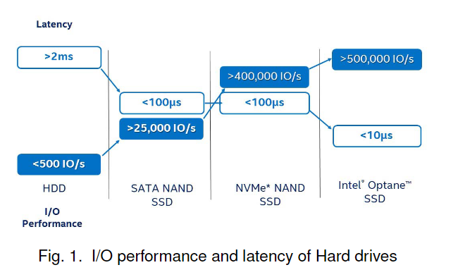
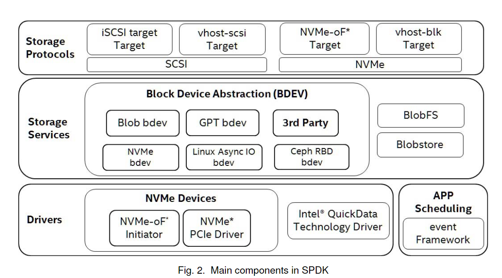
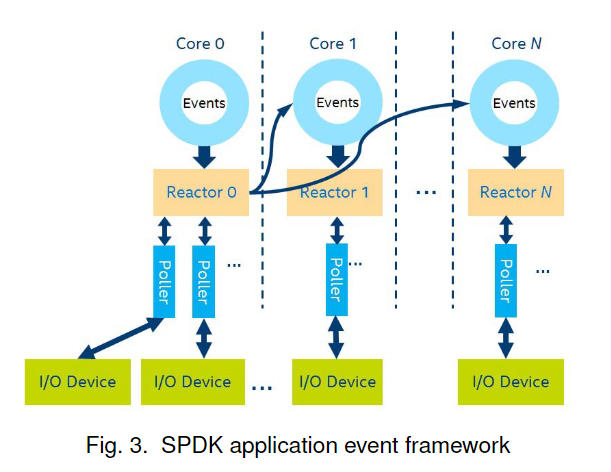
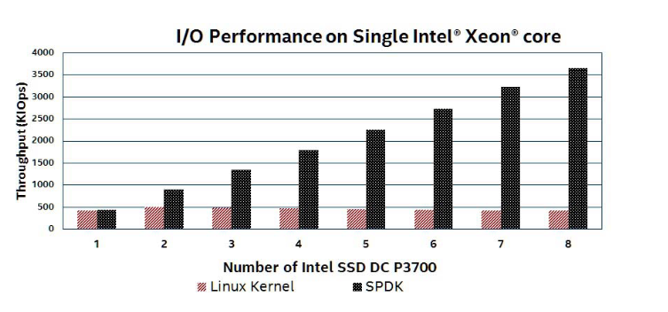
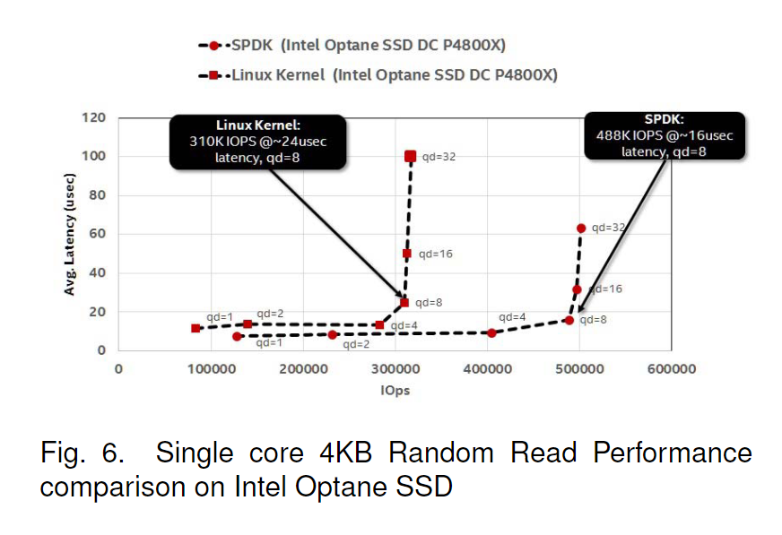

## 摘要
构建高性能存储服务的需求在日益增长的快速存储设备（例如NVMe SSD）上日益强烈。然而，当前的存储软件堆栈无法满足这些需求，软件开销已成为开发高性能存储应用的主要瓶颈。大多数存储软件开销是由内核I/O堆栈造成的，这主要源于上下文切换、数据拷贝、中断、资源同步等因素。本文通过将必要的驱动程序移动到用户空间，并以轮询模式而非中断模式运行它们，SPDK消除了内核上下文切换和中断处理开销，同时提供了无锁的资源访问。

## 背景
在低速存储设备时代，存储服务的性能主要由硬件组件（例如硬盘驱动器）决定，因为与硬件相比，软件开销微不足道。随着快速存储设备（例如NVMe SSD）的出现，由于硬件驱动器消耗的单个I/O操作的延迟降低到了几微秒，软件开销已成为提高存储应用性能的主要瓶颈。

## 系统设计与实现

SPDK 是一组程序库，可用于构建定制的高性能存储应用。SPDK 主要有四个主要组件，即驱动程序、应用调度、存储设备和存储协议。

### App scheduling
简单的服务器应用可以采用单线程的方式编写。而现实情况下往往需要多个连接跨线程来共享状态，因此，SPDK提供了一个事件框架来解决这个问题。

- Reactor: 每个核心生成一个Reactor线程，他们通过无锁的事件队列来进行通信。Reactor线程会循环检查每个核心上的事件队列，按顺序执行事件，事件函数不应该被阻塞，并且最好能够很快执行完毕。
- Event: 跨线程通信的唯一方式，每个事件由一个函数指针及其参数组成，被发送到特定的核心上执行。通过使用spdk_event_allocate()创建，并使用spdk_event_call()执行。
- Poller: 与事件类似，Poller是具有参数的函数，可以被发送到特定的核心以执行。但是，与事件不同的是，Poller会重复执行，直到被注销。Reactor会将Poller和其他Event交替执行。Poller代替中断来轮询硬件。如果不需要低延迟，轮询器也可以被安排在定时器上定期执行。

### User space polled drivers

轮询机制使得软件节省调用内核中断处理程序的开销，并减少上下文切换。它还允许用户决定每个任务使用多少CPU时间，而不是让内核调度器来决定，因此当新的I/O到达时，软件线程可以始终可用。尤其是在高负载的情况下助于提高I/O性能，因为减少了不必要的内核介入和上下文切换。然而，需要注意的是，轮询也可能导致CPU资源的浪费，如果设备没有准备好进行I/O操作，线程可能会在无意义地忙等待。因此，在设计和实现轮询机制时，需要仔细权衡其利弊。

- 异步IO：SPDK使用异步读写I/O模式来完成I/O请求。应用程序可以调用SPDK的异步读写接口来发送I/O请求，然后使用相应的I/O完成检查函数来拉取已完成的I/O操作。当I/O队列深度大于1时，这种方法比同步模式（即发送一个I/O请求并立即等待I/O完成）更高效。
- 无锁架构：传统上，在内核I/O堆栈中完成I/O请求时，需要访问共享资源。例如，在内核NVMe驱动程序中，不同CPU核心之间会存在对NVMe I/O队列的争用。为了消除资源共享带来的开销，SPDK采用无锁架构，要求每个线程访问自己的资源，例如内存、I/O提交队列、I/O完成队列等。（？）

### Storage services

- Block device abstration layer（bdev）：这种通用的块设备抽象是连接到各种不同设备驱动和块设备的存储协议的粘合剂。在块层中提供灵活的API用于额外的用户功能（磁盘阵列，压缩，去冗等等）。
- Blobstore：为SPDK实现一个高精简的文件式语义（非POSIX）。这可以为数据库，容器，虚拟机或其他不依赖于大部分POSIX文件系统功能集（比如用户访问控制）的工作负载提供高性能基础。
- Blobfs: 基于Blobstore的文件系统层。

### User space NVMe driver implementation

- UIO：通过UIO让用户程序可以直接访问设备。
- 无锁队列对（Lockless queue pair）：由于NVMe队列对（struct spdk_nvme_qpair）为I/O提供了并行的提交路径，SPDK提供的队列对不保证线程安全，因此跨线程共享队列对会导致未定义行为。（也就是说，每个队列对被一个用户态线程独享，但NVMe驱动应该会修改这个队列吧？）。
- 异步IO：I/O请求通过nvme_ns_cmd_xxx函数提交给NVMe命名空间。NVMe驱动程序负责将I/O请求放入相应的NVMe提交队列中，然后立即返回控制权给应用程序，而无需等待I/O操作实际完成。这使得应用程序可以继续执行其他任务，而不会被阻塞在I/O操作上。为了获取IO请求的执行情况，应用程序需要定期轮询每个包含未处理I/O的队列对。这通常是通过调用spdk_nvme_qpair_process_completions()函数来实现的，该函数会检查队列对上的完成队列，一旦有I/O操作完成，该函数会提供相应的完成回调，以便应用程序可以执行必要的后续操作或释放相关资源。

## Performance evaluation 

- 为什么增加SSD块数可以增加 IOps？

