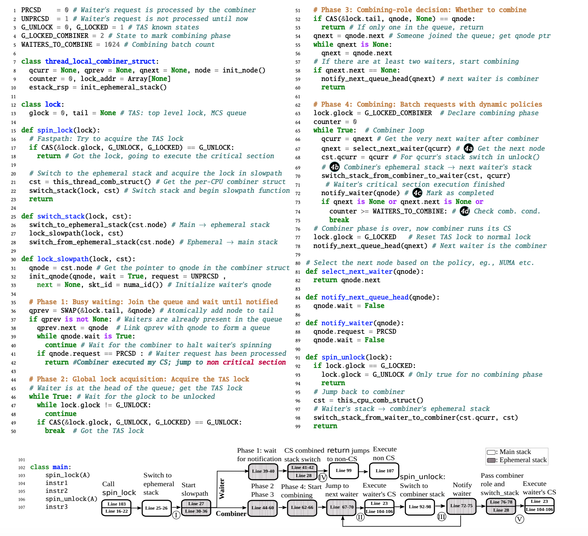

## 传统锁的问题
- 在NUMA架构中，如果本地缓存无法满足内存访问需求，那么访问远程内存的速度会比访问本地内存慢得多。
- 多核竞争共享资源会造成各个核心的缓存频繁失效，没有很好的程序局部性。
## 代理锁

优点：
- 所有的锁操作都在一个线程上，避免了乱序竞争，保证了公平性。
- 服务线程被绑定到某一个核心上，有很好的程序局部性。
缺点：
- 新增消息传输成本。
- 服务器线程中消息的排队时间可能过长。
- 需要对已有代码进行侵入性修改。

## 本文方法
- 设计了一套兼容原始 lock/unlock API的代理锁接口TCLocks。
- TCLOCKS通过让已获得锁的线程代理处理排队的临界区请求，实现了锁代理，同时保留了原有的lock/unlock封装，保证了原始代码的兼容性。

- 存在的问题：延长了combiner的执行时间。