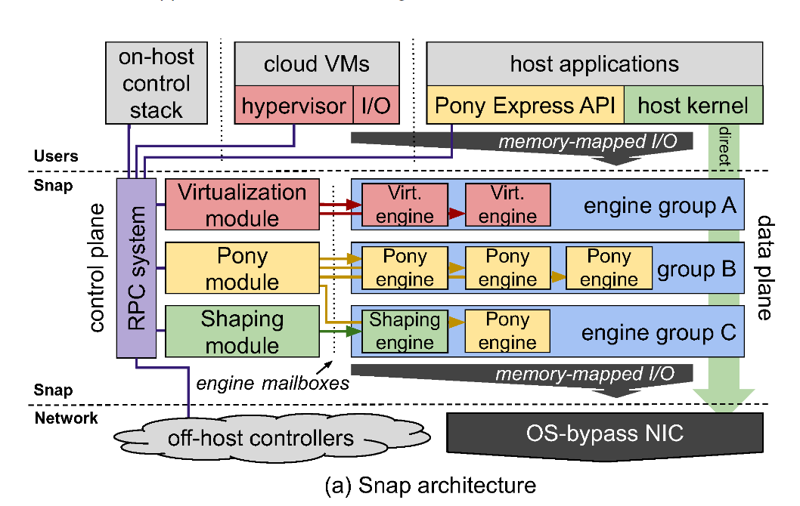
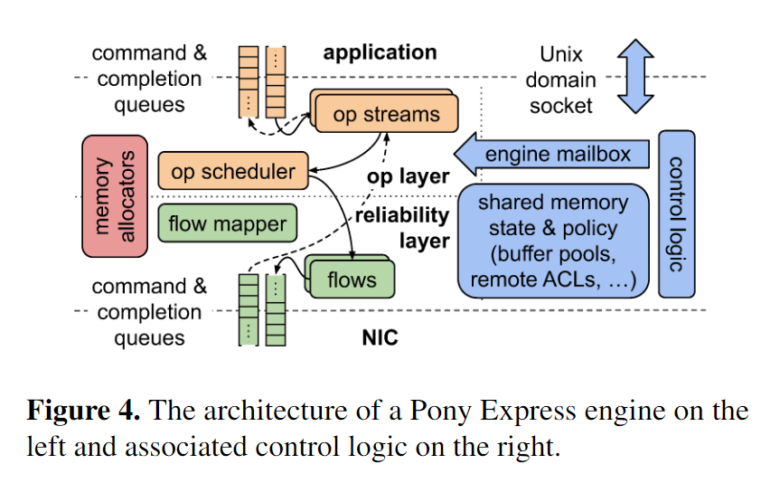

# 问题引入

将网络功能从内核空间移动到用户空间的原因：
-  内核代码迭代速度慢，开发困难。
- 常见的情况需要机器重新启动，这需要排空正在运行的应用程序。
- 改变基于内核的软件栈需要1-2个月的部署时间。
- Linux的广泛通用性使优化变得困难。

本文介绍了一种基于微内核思想的主机网络方法，称为Snap。Snap是一个用户空间网络系统，具有灵活的模块，实现各种网络功能，包括：
- 边缘数据包交换
- 云平台的虚拟化
- 流量整形策略执行
- 高性能可靠消息传递
- 类似RDMA的服务

# 系统设计

## microkernel-inspired approach

Snap将网络功能实现为普通的Linux用户空间进程，具有以下好处：
- 保留了单体内核的集中资源分配和管理优势。
- 透明的软件升级方式实现高速功能开发。
- 使用Linux内核接口将CPU和内存的消耗精确归因于应用程序。
- 利用用户空间安全工具，例如内存访问消毒器和Fuzz测试。

Snap与现有的内核网络功能和应用程序线程调度器可以互操作。Snap通过自定义内核数据包注入驱动程序，同时通过Snap和Linux内核网络堆栈进行数据包处理。

Snap实现了自定义CPU调度器，而无需采用新的运行时。

## Framework

总体上，Snap被划为为Control Plane和Data Plane两个部分。RPC System提供Snap Control Plane和其它应用进程、VM等通信，但是Data Plane的通信则是用memory-mapped IO实现的，而中间的Control Plane和Data Plane之间的通信通过engine mailbox，一种特殊的非中心化的RPC机制(a specialized uni- directional RPC mechanism)。另外不同流量由不同的Pipeline来处理。

### Engine

Snap将数据包处理功能（数据平面操作）封装为可组合的单元，称为“引擎”。这些引擎是有状态的、单线程的任务，由Snap引擎调度运行时进行调度和运行。一个engine的可能有多个输入/输出，输入/输出可以是其它的应用进程、guest，或者是内核的pagkets ring buffer，网卡的输入/输出队列，还可以是其它的engine等。为了实现更好的性能，这里一般通过共享内存进行通信。

不同的Engine要求是不同的，比如有的更需要更大的带宽，有的则更加倾向于更低的延迟。Snap将不同要求倾向的Engines组织为Group，给不同的Group分配不同的调度策略，来达到资源的有效利用。

### CPU Scheduling

Snap实现了三种engine的调度策略，三种调度策略各有优势，也各自适用于不同特点的engine group。
- Dedicating cores：这种方式指定一个单独的CPU来运行engines，其他任务不能在该核心上运行。这种调度方式的特点是总体的调度时延最低，但长尾效应严重，且CPU利用率低。
- Spreading engines: 每个engine运行在一个线程上，当空闲时会阻塞掉，等待NIC中断或用户的系统调用将其唤醒。这种方式的特点是总体的调度时延高（由于线程切换开销增大），但长尾效应小，且CPU利用率较高。
- Compacting engines：Snap根据工作负载动态扩缩容需要运行在cpu上的线程，尽可能地将任务运行在更少的核心上面，算是结合了上述两种方式，整体时延和尾部时延都较小，且CPU利用率极高。

### Modules and Control-to-Engine Communication

模块，Snap的Module负责设置Control Plance的RPC服务，实例化Engine，并将Engines设置为Engine Group。另外负责设置好用户的设配置。和外部的应用通信通过RPC，而和Engines通信使用Lock-Free的engine mailbox。

> 为了支持Snap的实时、高性能需求，control components件过engine mailbox与engine进行无锁同步。该邮箱是一个深度为1的队列，在该队列上，control components发布短工作部分，由engine在自己的线程上同步执行，并以与engine无阻塞的方式进行。

## Pony Express

Pony Express是Snap中由于实现传输协议的一种机制。Pony Express不是一个TCP/IP的重新实现，这里Pony Express使用了更加灵活的接口，可以实现更加丰富的传输协议，比如支持RDMA。

在Pony Express中，传输的处理在单独的线程中处理，与应用的线程分离开。通过设置线程的亲和性来优化在NUMA节点和NIC的通信开销，另外Pony Express的线程和其它的egines线程、传输处理线程共享CPU而不是应用线程可以实现更少的上下文切换、更好的局部性以及可以通过轮询减少延迟等的效果。

Pony Express的基本架构如下，总体上Pony Express分为两层，上层实现应用层面的state machines，而下层实现可靠传输和拥塞控制。下层不会处理重排序、组装以及语义等方面的问题。两层之间的联系会有一个flow mapper。

# Evaluation

- 在基准测试中（单连接流），TCP的单流吞吐量为22Gbps，利用率为1.2个核心/秒，而Snap/Pony的吞吐量为38Gbps，利用率为1.05个核心/秒。
- 使用5000B MTU，Snap/Pony的单核吞吐量增加到超过67Gbps，并启用I/OAT接收复制卸载（使用零拷贝tx），吞吐量可以增加到超过80Gbps。
- TCP的平均RTT延迟为23微秒，而Snap/Pony的RTT延迟为18微秒。使用自旋轮询的配置，可以将Snap/Pony的RTT延迟降低到小于10微秒，而在Linux中使用轮询套接字可以将延迟降低到18微秒。
- Snap引擎调度程序（“Spreading engines”和“Compacting engines”）都可以按照负载的比例扩展CPU消耗，并显示出由于批处理效率而产生的亚线性增长的CPU消耗。在高负载下，Snap比TCP高效3倍，作者将原因归为：
	- 减少数据复制。
	- 避免细粒度同步。
	- Compacting engines有更好的数据局部性。

