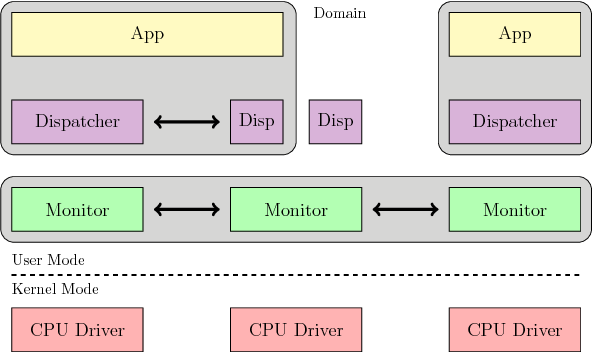

# 现状分析
当前的大型商用服务器上安装者成百上千核的多核处理器，上面却运行者单个操作系统镜像。在可预见的未来，处理器的核心会越来越多。
- 系统硬件的多样性增加：通用的操作系统采取的同步策略不能最大化利用某一个特定硬件的自己的同步策略。（eg，一个同步读写锁的例子，连续写一个在多个L2 Cache上都有缓存的内存地址，传统的multiprocessor会出现内存抖动，而Sun Niagara processor不会。因此作者认为随着硬件多样性的增加，通用操作系统在多核操作系统的缓存一致性的支持将越来越有限。
- 一个CPU中的核越来越多，传统的缓存一致性协议越来越难以适用。（在有成百上千的核的CPU中，当一个核标记某一个cache line为独占的时候，其他核都要从内存中去访存）。
- 同一个CPU中的核的异构性：
	- 相同ISA的不同性能指标（如大核不适用于并发程序，而小核不适用于顺序任务）。
	- 不同的ISA

# 设计原则
- make all inter-core communication explicit
	- 使用消息传递的机制进行交流，而不是共享状态，这样不依赖与缓存一致性。
	- 天然地支持core异构。
	- 这样的异步消息机制不需要等待所有core的更新执行完成后才继续执行，提升并发性。
- 与硬件解耦。
	- 只有消息传递机制和设备驱动需要硬件实现
- 使用复制状态而不是共享内存。
	- 通过消息传递来保证各个核的一致性。

基于以上原则，作者提出新的多核的操作系统内核架构： The Multikernel，把在每个物理核心上运行自己的OS Kernel（称为OS node），不同的物理核心在软件层通过收发异步消息进行通信。

相比于传统的多核单内核的操作系统而言，The Multikernel提供了一个分布式系统的视角来设计操作系统内核。

对比传统的内核中共享一些全局的数据结构，通过锁来保证读写安全，增加了大量的等待开销，The Mutilkernel提供的管道通信和批量消息编码的远程操作允许单个核心实现更大的吞吐量和更小的互连比率（更小的互连比率这里不太理解）。

此外，消息传递机制能够更好的支持硬件异构。

# Barrelfish

## CPU drivers
CPU Driver是Barrelfish的内核，运行于Barrelfish所运行的机器上的单个处理器核心里，支持多种处理器架构。CPU Driver是单线程、不可抢占的，运行在关中断的模式下。可以认为它在连续地运行异常处理程序，比如中断(interrupt)、异常(fault)、来自用户空间的系统调用(system call)。如果没有可以运行的异常处理程序，它就执行一个用户空间的任务。

它的主要功能有：
- 负责时钟中断和全部异常，并将其他高级中断转发到用户层
- 调度本核上的所有用户进程(Dispatchers）
- 基于Capabiltiy提供一组最基本的系统调用接口为用户应用和高级系统服务应用提供服务
- 负责本核上的进程间通信
- 对硬件的安全访问(MMU、APIC等等)
- 对内存和内核对象的访问(基于capability(权能)实现)（不懂）
- 启动初始化过程和调起第一个用户进程

## Monitor
Monitor共同协调系统范围的状态，并封装了传统操作系统内核中的大部分机制和策略。它是运行在用户空间的一个进程，可以被调度，因此非常The MultiKernel模型的分阶段、面向消息的内核间通信，特别是RPC消息处理。在每个核心上，复制的数据结构，例如内存分配表和地址空间映射，通过Monitor运行的协议保持全局一致。访问全局状态的应用程序通过Monitor来协调远端状态，获取一致性数据，一致性协议使用2PC。

同时，Monitor还承担起跨核的进程间通信的功能。

## Process structure
程序（Program）在传统的操作系统上运行是通过进程（Process）的形式。而 Barrelfish OS 是通过 Dispatcher 的形式。

当CPU driver根据调度结果决定运行某一个dispatcher时，内核需要“upcall”该dispatcher，系统从内核态进入用户态，之后与该dispatcher对应的用户级代码开始执行用户空间的线程调度，以及处理其他事件（比如来自内核的缺页错误、或者Domain间消息）。

一个程序运行后以一个 Dispatcher 的形式运行在 CPU 中，如果一个程序有多个进程同时运行，那么则会有多个 Dispatcher 运行在多个 CPU 上。Dispatcher 要做的是指定一个用户线程线程并让该线程运行。（一个CPU driver一个内核线程）。

## Memory management
借鉴seL4的capability机制来管理内存，暂时没有深究。

## Inter-core communication
不同的硬件可以实现自己的消息传递机制，作者在BarrelFish中使用共享内存区域用作通道，在单个写入器和读取器核心之间点对点传输缓存行大小的消息。作为一种优化，可以通过使用缓存预取指令以牺牲单消息延迟为代价来提高流水线 URPC 消息吞吐量。

接收消息通过轮询内存来实现，因为通道内存在Cache 中。

一个例子是：Monitor中的调度程序需要决定应该执行哪一个Dispatcher，此时需要访问全局一致的任务队列，当然，在本地有一个全局一致的任务队列副本，因此需要先发送更新请求到各个核上，然后开始轮询各个消息通道，当然，永远等待是不合理的，在短时间内轮询这些通道，然后阻塞并向其本地监视器发送请求，以便在消息到达时得到通知，更新完毕后向从队列中取出任务开始执行。

## Shared address spaces
Barrelfish 通过协调每个Dispatcher上的运行时库来支持跨多个Dispatcher共享单个虚拟地址空间的传统线程模型。（这里定义的线程是共享虚拟地址空间和一些其他资源的Dispatcher）

共享的虚拟地址空间可以通过共享硬件物理页表实现，也可以通过复制物理页并通过消息传递机制来保证一致性来实现。前者是典型的高效简洁，后者却可以有效减少跨核心的TLB miss（为啥？），同时后者也是在不支持相同页表格式的内核之间共享地址空间的唯一方法。

除了共享地址空间外，用户应用程序还期望跨内核共享capability（？）。

跨核线程的管理在用户空间进行，每个Dispatcher上的调度程序通过Monitor发送消息来创建、唤醒、阻塞其他核的Dispatcher。

# 个人理解
1. 第一节提到的通用操作系统对缓存一致性的支持感觉理解的有点问题，Cache的一致性是由硬件协议保证的，应该是Cache的一致性为操作系统的正确性提供保障，为什么需要操作系统为Cache一致性做适配呢？

	这里的理解应该是：通用的操作系统只会采取通用的策略来进行处理，而对于某些处理器的一些在Cache上做的优化，通用操作系统是无法识别并适配的，而当每个核上运行不同的kernel的时候，kernel就可以根据核的特点做更多的优化。
	
2. 对于多核而言，不同核上具有相同内存的地址的cache，不同线程在不同核上修改同一个内存单元，这个时候的读写安全能否由Cache一致性直接保证而不用操作系统额外加锁？

	肯定不行，加锁的目的不仅是为了保证数据一致，更是为了保证不写到一半被打断另一个读到非法的数据。
	
3. 为什么通过复制物理页的方式实现传统线程模型可以减少TLB miss？
4. 关于论文的优缺点：
	1. 优点：
		1. 个人理解，在所有核通过共享内存的方式来访问公共资源的时候，由于各个核的处理流程和处理状态在不完全相同，因此很容易造成死锁的情况，要正确管理各个锁比较困难。而Barrelfish通过复制的方式在各个Monitor中维护了全局一直的数据结构的备份，将所有的全局数据集中进行维护，宏观上看，好像是维护了一个分布式的数据库，通过分布式一致性协议来保证一致性，所有的全局数据都存放到数据库里，所有的访问修改都通过数据库操作，极大减小了数据维护和锁维护的负担。
		2. 与CPU核解耦，一定程度上与内核解耦，不同的CPU和内核通过适配 CPU driver的接口功能就能进行扩展。
		3. 单独设计的内核可以更好的利用CPU核心的特性，来达到更好的性能。
	2. 缺点：
		1. 消息传递机制使用共享内存的通道实现，而且是用双通道实现的全双工机制。在核数为n的情况下，最坏的通道数是 n * (n - 1)条，在核心数过多的时候不可接受。
		2. 全局的数据结构需要强一致性来维护，而强一致性往往是通过高频度的消息通信实现，否则，只能牺牲实时性来保证一致性。
		3. 这两个其实都有缓解的办法，原文作者提到的，可以将相邻的两个核共享一份全局变量的内存；此外，在实现中，将特征性较强的事务使用同一个核来进行处理，例如，将文件读写的进程放到一个核上执行，只需要在一个核上保存Disk的状态即可。