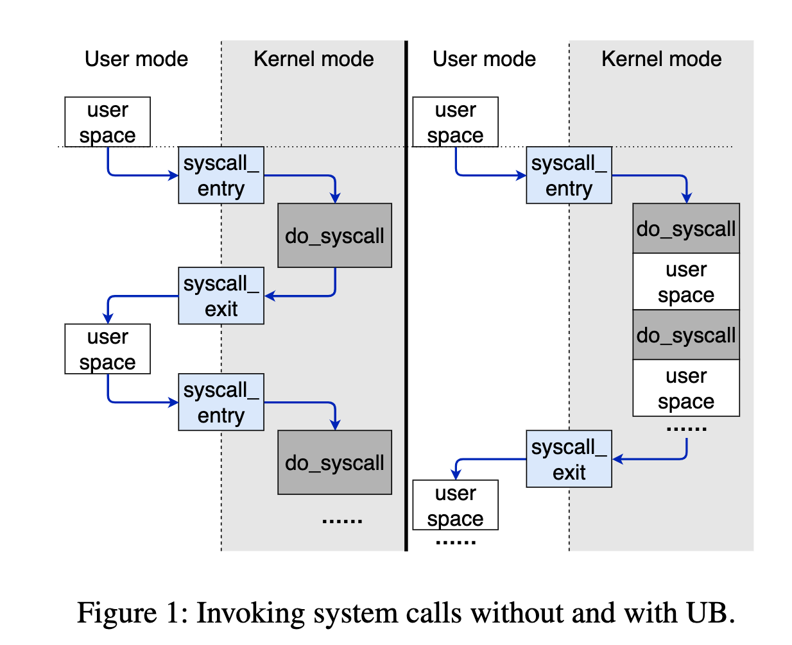
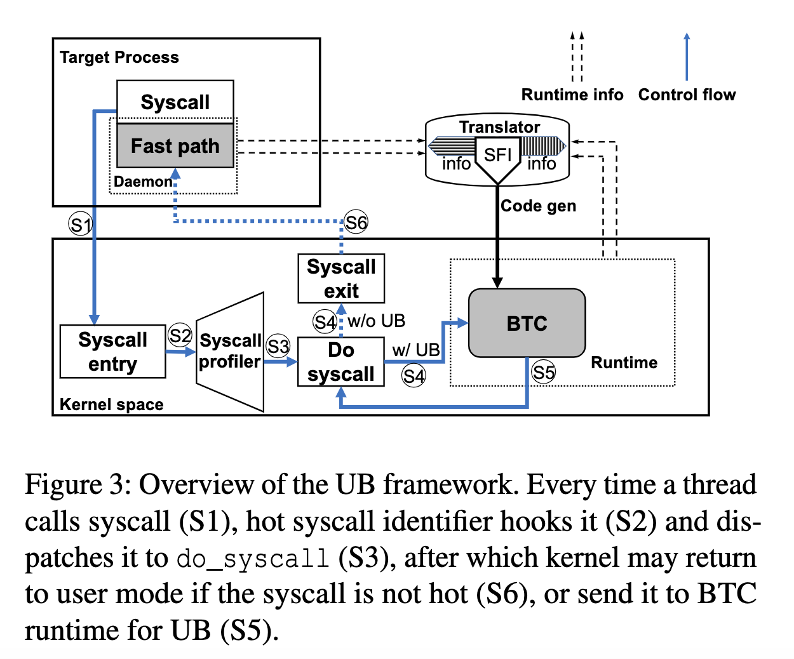

##  Background  Target
目标是通过运行时BTC（二进制翻译）自动识别频繁调用系统调用的代码段，并将系统调用之间的代码安全的提升到内核态执行，用以减少特权级切换和页表切换。
- 异步系统调用：这种方法并没有真正意义上减少系统调用开销。而且到目前为止，在Linux上大部分系统调用的实现仍然是同步的。
- Syscall batching：批量提交请求，减少内核切换次数。需要显式修改程序，不能保证兼容性。
- Unikernel: 需要编写内核代码，对开发者不够友好。
- Kernel Bypass：如DPDK，绕过内核直接访问IO设备，同样需要修改用户态程序。

## Framework

包含了三部分：Hot Syscall Identifier、BTC translator、BTC Runtime

### Hot syscall identifier

捕获每一个系统调用，进行由粗到细的三层粒度的筛选和记录：
- syscall sampling：无差别稀疏采样，为了减少额外的运行时开销，只采样10%的系统调用进行下一步分析。
- Coarse-grained profiling：检查当前的线程的系统调用频率是否达到阈值，达到之后进行下一步分析。
- Fine-grained profiling：进一步维护当前线程中固定数量的系统调用（包含了系统调用操作码、RIP寄存器、以及下一次系统调用在4微妙内出现的次数「counter」）。当counter大于某一个阈值的时候，认为是Hot syscall。

### BTC Translator

- 该组件会把用户态的指令转换成BTC，并让BTC runtime执行它。
- 在SFI的指导下，它会把危险指令转换成安全指令（例如间接跳转变成直接跳转），并且插入内存边界检查和行为控制的代码。
- 转换器运行在一个独立的用户态空间从而防止把它的代码引入kernel中。这个转换不会block应用的执行，并且转换后的代码是在下一次相同代码被使用时才被执行。
- 除了把这些用户态指令进行优化外，还有一些额外的优化，例如根据jump目标来逐渐优化出更多fastpath。

### BTC Runtime

该组件通过跳转保护、寄存器重映射、指令保护和内存保护等方法在内核中安全地执行BTC translator产生的BTC。

## Personal Thinking

1. 主要想法是通过将频繁的系统调用之间的少量用户态代码提升到内核态执行，减少切换次数。
2. 最大的优势是无需更改用户程序，而且由于是运行时进行分析 + 二进制翻译执行，因此即使是非开源的二进制文件也能进行加速。
3. 