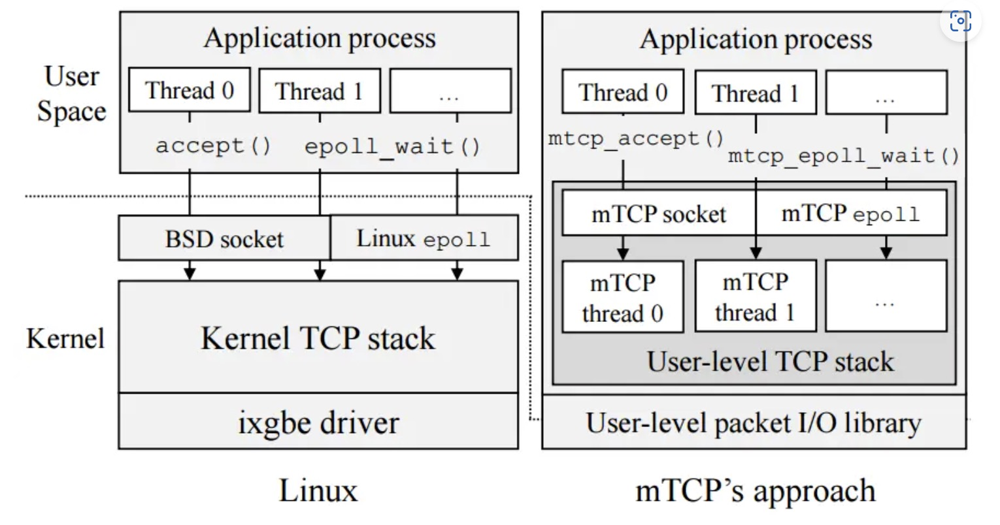

## Background & Motivation

运行在内核态的TCP协议栈需要占用过多的CPU周期。对于大量数据来说，传输开销不在于协议栈的处理流程，但是现如今数据量小的TCP连接越发常见，所以协议栈开销所占比重增大。

- 互斥上锁引起的开销
- 报文造成的处理效率低下
- 频繁的系统调用引起的负担
- 局部性不良引起的性能下降

在该文之前的研究与优化方法均没有解决协议栈性能受制于CPU的情况，于是该文提出在用户态实现TCP协议栈的功能，从而提升性能。除此之外，作者还综合了之前所有已知的优化方法。

## Design

### 多核扩展性

为了避免多线程访问共享的资源带来的开销。`mTCP`将所有资源(如`flow pool` `socket buffer`)都按核分配，即每个核都有自己独有的一份。并且，这些数据结构都是`cache`对齐的。

从上面的架构图可以看到，`mTCP`需要为每一个用户应用线程(如`Thread0`)创建一个额外的一个线程(`mTCP thread0`)。这两个线程都被绑定到同一个核(设置`CPU`亲和力)以最大程度利用`CPU`的`Cache`。

### 批量报文处理机制

由于内部新增了线程，因此`mTCP`在将报文送给用户线程时，不可避免地需要进行线程间的通信，而一次线程间的通信可比一次系统调用的代价高多了。因此`mTCP`采用的方法是批量进行报文处理，这样平均下来每个报文的处理代价就小多了。

### 类`epoll`事件驱动系统

对于习惯了使用`epoll`编程的程序员来说，`mTCP`太友好了，你需要做就是把`epoll_xxx()`换成`mtcp_epoll_xxx()`

### BSD 风格的 socket API

同样的，应用程序只需要把`BSD`风格的`Socket API`前面加上`mtcp_` 就足够了，比如`mtcp_accept()`

### 支持多种用户态Packet IO库

在`mTCP`中， `Packet IO`库也被称为`IO engine`, 当前版本(v2.1)`mTCP`支持`DPDK`(默认)、 `netmap` 、`onvm`、 `psio` 四种`IO engine`。

### 数据包处理过程

![[../image/mTCP-2.png]]

mTCP线程从NIC的RX队列中读取一批数据包，并将它们传递给遵循标准TCP规范的TCP包处理逻辑。对于每一个数据包，mtcp首先会在流哈希表搜索相应流的tcp控制块(tcb)。如图3所示，在服务端收到一个SYN/ACK数据包的ACK后，新连接的tcb将会被放到accept queue（2），并为监听套接字生成一个read event（3）。如果有新数据包到达，mtcp会copy数据包的负载到套接字的read buffer并生成一个read event放到internal event queue。同时mtcp会生成一个ACK数据包放到TX manager的ACK列表中。

当批处理完收到的数据包后，mtcp会将queued中的event刷新到应用层的event queue（4）中，并通过信号唤醒应用层。当应用层被唤醒后，使用epoll批处理多个事件（5），并写入来自多个流的响应而没有上下文切换。每个套接字的write()调用写数据到send buffer（6），并将tcb放到write queue（7）。后面，mtcp会收集需要发送数据的tcb，并放到send list（8）。最后通过packet I/O系统调用将list中的数据包发送出去，并将它们传输到NIC的TX queue。