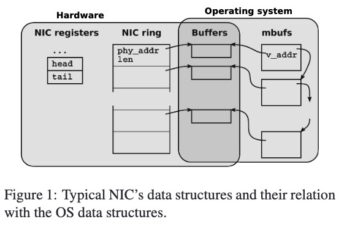
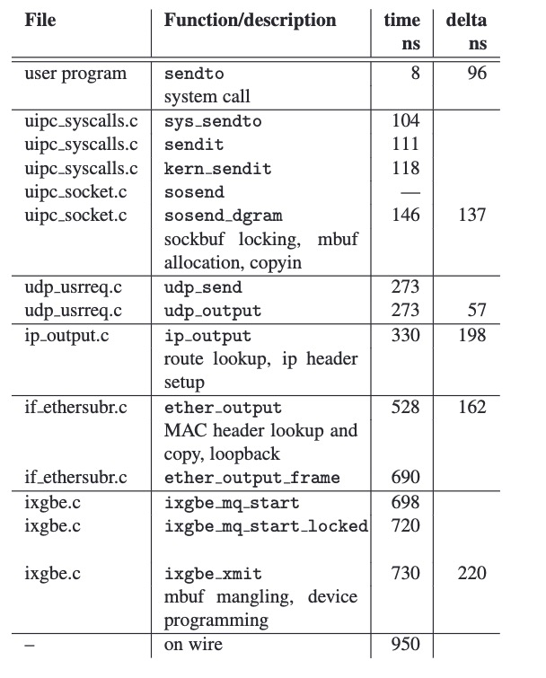
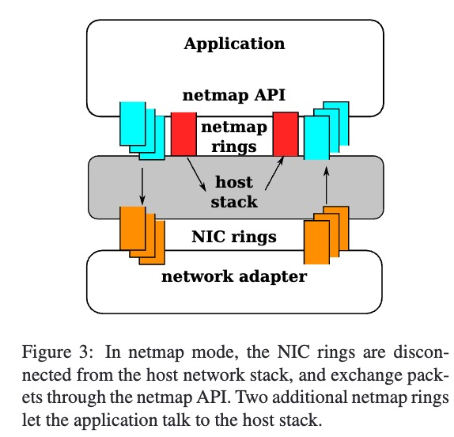
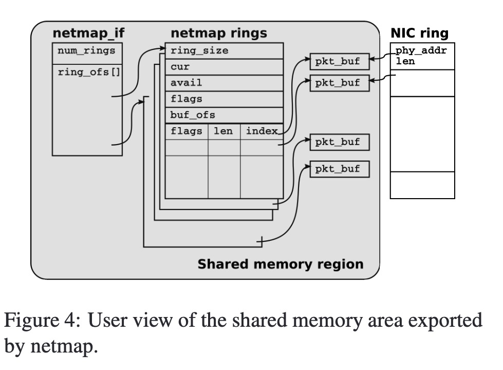
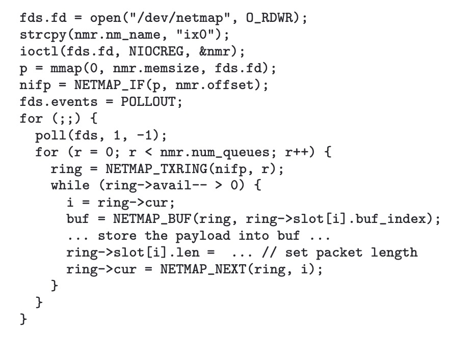
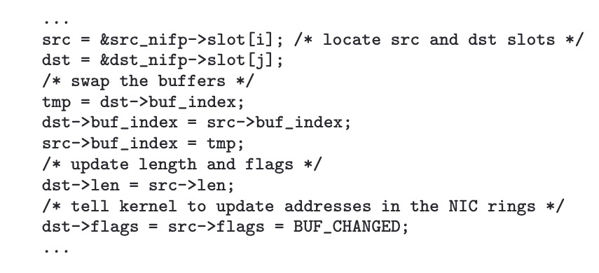
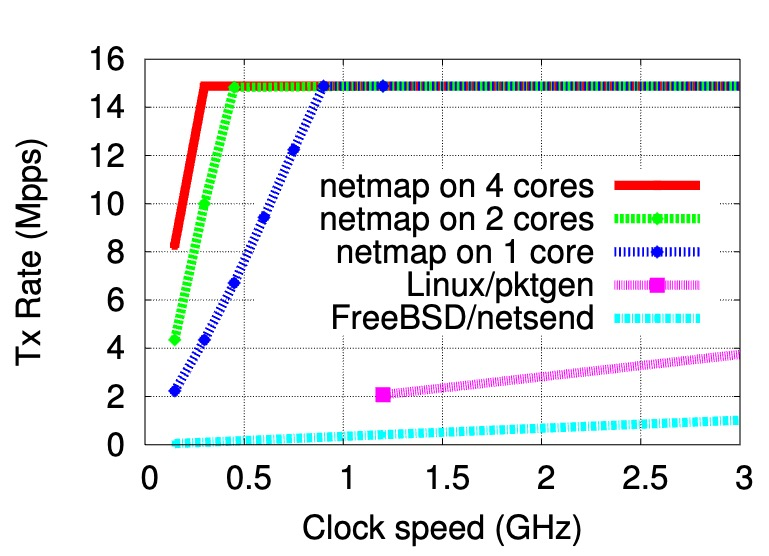
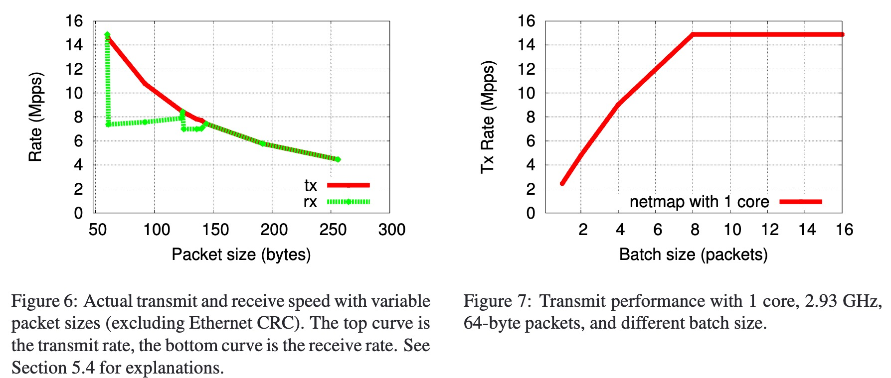

## 摘要
netmap是一个网络框架，通过在通用操作系统上进行少量地修改，使得通用操作系统能够每秒处理数百万个数据包，而无需定制硬件或对应用程序进行修改。

netmap识别出通用操作系统网络包处理中三个比较耗时的环节并进行改进：
- 数据包的动态内存分配：预分配内存。
- 系统调用的开销：通过大批量处理来摊销。
- 内存复制：共享内核和用户空间之间的缓冲区和元数据来消除，同时仍然保护对设备寄存器和其他内核内存区域的访问。

特点：超过了大多数以前工作的性能，不依赖于特定的硬件，易于使用和维护。

## 背景

通用操作系统的网络包处理主要分为两个阶段：
- NIC data structures and operation：通过缓冲区描述符的循环队列管理进出数据包：
	- RX：输入的packet通过DMA被存储在下一个可使用的buffer中，并将length/status 信息写回到相应的slot，以指示新数据的可用性。中断通知 CPU 这些事件的发生。
	- TX：操作系统将数据填充到NIC期望的缓冲区中，并通过写NIC寄存器来发起发送请求。随后NIC开始处理在TX ring中被标记为可用的数据包。
- Kernel and User API：
	- 操作系统维护着网络接口控制器（NIC）数据结构的影子副本，存储着每个packet buffer的元数据：size、source、dest interface等，标记着OS和NIC应该如何处理这个包。
	- 驱动程序/操作系统：驱动和OS之间的接口定义假定数据包在两个方向上都会被分片，因此API期望子系统能够保留数据包来进行分片合并，所以buffer和元数据不能简单的在函数调用期间通过引用传递，而必须被复制或者引用计数，这种分片合并的灵活性以运行时开销为代价。这种设计对于当今的系统来说，开销太大了。分配、管理和遍历缓冲区链的成本通常超过了将内容线性化的成本
	- Raw packet I/O: 用户程序用于读取/写入原始数据包的标准 API 至少需要一次内存复制，一次系统调用。

通用操作系统提供了一个丰富且灵活的环境，用于运行各种任务，包括许多数据包处理、网络监控和测试任务。然而，这些应用所需的高速率原始数据包 I/O 并不是通用操作系统的设计目标。

以FreeBSD的sendto为例：

耗时较长的操作有：
- 系统调用。
- mbuf构造和数据拷贝。
- 协议层报文头填充。
- 将mbuf和元数据转化为NIC格式。

## netmap Design

我们提出的框架名为 netmap，它是一个系统，旨在为用户空间应用程序提供对网络数据包（包括接收和发送端以及来自/发往主机堆栈的数据包）的非常快速的访问。效率的提高并没有以牺牲操作的安全性为代价。此外，netmap 的一个独特之处在于，它尝试设计和实现一个简单易用、与现有操作系统机制紧密集成、并且不依赖于特定设备或硬件特性的 API。

netmap 通过以下技术实现其高性能：
- 一种轻量级的元数据表示方法，该方法紧凑、易用，并且隐藏了设备特定的特性。此外，这种表示方法支持每次系统调用处理大量数据包，从而分摊了成本；
- 线性、固定大小的包缓冲区，这些缓冲区在设备打开时预先分配，从而节省了每个数据包分配和释放的成本；
- 通过授予应用程序对包缓冲区的直接、受保护的访问权限，消除了数据复制的成本。相同的机制还支持接口之间的零拷贝数据包传输；
- 支持有用的硬件特性（如多个硬件队列）。

从最高的抽象层次来看，当一个程序请求将一个接口置于 netmap 模式时，NIC 会部分地与主机协议栈断开连接，程序通过共享内存中实现的缓冲区循环队列（netmap rings）获得了与 NIC 以及（单独地）与主机栈交换数据包的能力。传统的操作系统原语，如 select()/poll()，被用于同步。除了数据路径中的断开连接之外，操作系统并不知道这一变化，因此它仍然像常规操作期间一样继续使用和管理接口。

### 数据结构

为每个网卡接口关联三种用户可见的对象，系统中所有启用 netmap 的接口的所有对象都位于同一个内存区域中，该区域由内核在非分页区域中分配，并由所有用户进程共享：
- packet buffers：固定大小，每个buffer有唯一索引，用于转换为虚拟地址和物理地址。当接口被设置为netmap模式时，所有的buffer都会被预分配。描述buffer的元数据（如索引、数据长度和一些标志）存储在接下来描述的 netmap 环形队列的槽位中。每个buffer都由一个 netmap 环形队列和相应的硬件环形队列引用。
- netmap rings: 是 NIC 实现的循环队列的设备无关副本
	- ring size：环中slot的数量。
	- cur：当前读写位置。
	- avail：可用的数量。
	- buf_ofs: 环形队列与固定大小的缓冲区数组起始地址之间的偏移。
	- slots[]：一个包含环形队列大小的条目的数组。每个槽位包含对应数据包缓冲区的索引、数据包长度，以及一些用于请求对缓冲区执行特殊操作的标志位。
- netmap_if descriptors：包含描述接口的只读信息，如环形队列的数量以及一个数组，该数组包含了 netmap 接口与接口关联的每个 netmap 环形队列之间的内存偏移量（同样，使用偏移量是为了使寻址位置无关）

netmap ring除了在执行系统调用之外，其他时候都属于用户态读写，系统调用期间依然是在用户进程的上下文中更新它。中断处理程序和其他内核线程永远不会涉及到netmap ring。

在 cur 和 cur+avail-1 之间的buffer由用户空间应用程序拥有，而其余的buffer则由内核拥有（实际上，只有 NIC 访问这些缓冲区）。这两个区域之间的边界在系统调用期间进行更新。

### netmap API

将接口转为netmap mode的流程：
- 打开特定的设备 /dev/netmap
- 发送一个 ioctl(.., NIOCREG, arg) 命令给file descriptor。其中参数包含了接口名称及想通过该file descriptor控制哪些ring的说明。成功后返回共享内存区域的大小及netmap_if的偏移量。
- file descriptor发出 mmap() 命令开放内存给进程的地址空间。完成file descriptor与某个接口及其ring的连接。
- 发送：从slot cur开始，发送 ioctl(.., NIOCTXSYNC) 命令，告诉OS有新的packets想发送。然后系统调用将信息传给kernel，kernel更新netmap ring中的avail区域。
- 接收：发送 ioctl(.., NIOCRXSYNC) 命令，询问OS有多少packet可读，然后从netmap ring中的slot中读取packet的长度和有效载荷。

NIOC\*SYN的ioctl都是非阻塞的，不涉及数据复制，这些系统调用在内核态会执行如下操作：
- 验证 cur/avail 字段和涉及的槽位的内容。
- 同步 netmap rings和硬件rings中槽位的内容（还需要同步吗？不是同一片内存？），并向 NIC 发出命令，以通知要发送的新数据包或新可用的接收缓冲区；
- 更新 netmap 环形队列中的 avail 字段。

内核中的工作量很少，执行的检查确保用户提供的共享数据结构中的数据不会导致系统崩溃。

阻塞IO通过 select() 和 poll() 系统调用提供支持。Netmap 文件描述符可以传递给这些函数，并且在 avail > 0 时唤醒调用者，在从 select()/poll() 返回之前，系统会更新环形队列的状态，这与 NIOC\*SYNC ioctl 的操作相同。这样，在事件循环中循环的应用程序每次迭代只需要一个系统调用。

### Talking to the host stack

即使在 netmap 模式下，操作系统中的网络堆栈仍然负责控制接口（通过 ifconfig 和其他函数），并会生成（或期望）来自/发往接口的流量。这种流量通过一对额外的 netmap 环形队列来处理，可以使用 NIOCREG 调用将其绑定到 netmap 文件描述符。对这些环形队列中的一个执行 NIOCTXSYNC 操作会将缓冲区封装成 mbufs，然后将它们传递给主机网络栈，就像它们来自物理接口一样。而来自主机网络栈的数据包则会被排队到“主机网络栈”的 netmap 环形队列中，并在随后的 NIOCRXSYNC 操作中提供给 netmap 客户端。

### Safety Considerations

- 用户态与内核态共享内存：使用 netmap 的进程，即使行为不当，也无法导致内核崩溃，共享内存区域并不包含关键的内核内存区域，而且缓冲区索引和长度在使用前总是由内核进行验证。
- 行为不当的进程可能会破坏其他人的 netmap 环形队列或数据包缓冲区。这个问题的简单解决方法是为每个环形队列实现一个单独的内存区域，这样客户端就不会相互干扰（还没有实现）。

### Zero-copy packet forwarding

将所有接口的缓冲区都放在同一个内存区域中，接口之间的零拷贝数据包转发只需要交换入站接口接收槽和出站接口发送槽之间的缓冲区索引，并相应地更新长度和标志字段。

### libpcap compatibility

为了解决兼容性问题，在 netmap 的基础上编写了一个小型库，该库将 libpcap 调用映射为 netmap 调用。由于 netmap 使用了标准的同步原语，因此只需要将读取/写入函数（如 pcap dispatch() 和 pcap inject()）映射为等效的 netmap 调用——总共大约 20 行代码。

## Performance Evaluation

两个简单的程序：
- 不断流出预生成packets的packet生成器
- 只计算接受packets数目的packet接收器

当包大小不是64的整数时，性能下降，这是因为NIC在对非完整缓存行发起写入命令时采用的是 读-修改-写回的周期，因此造成性能陡降。

## 总结

- 所有接口的数据结构在同一片内存区域中，行为不当的进程可能会破坏其他人的 netmap 环形队列或数据包缓冲区，但如果为每个环形队列实现一个单独的内存区域，就无法获得 Zero-copy packet forwarding的好处。